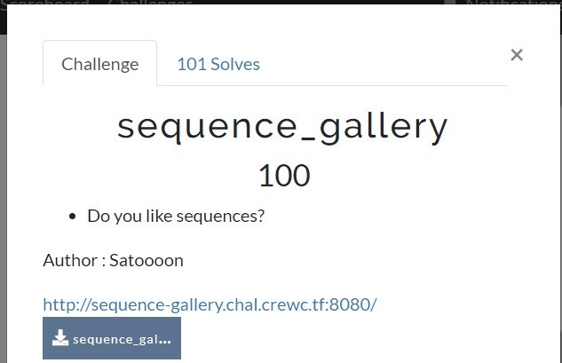
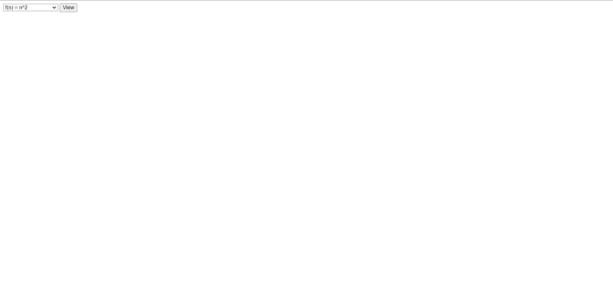
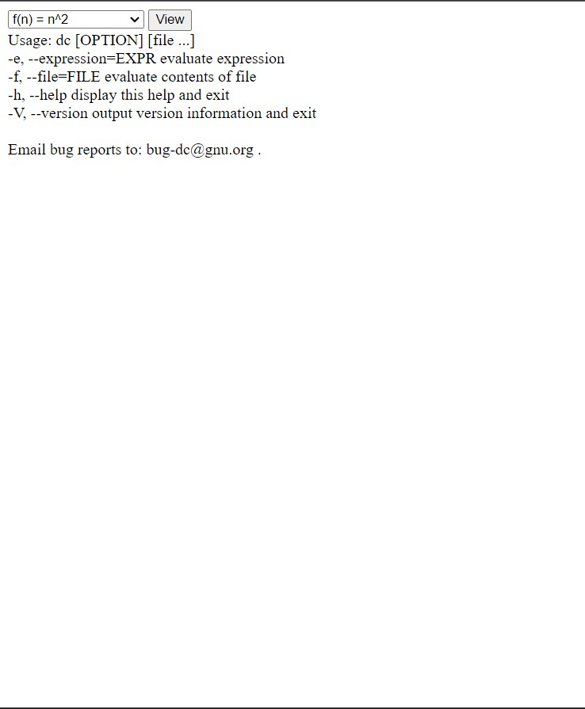
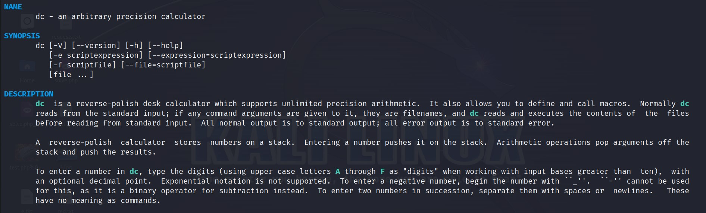
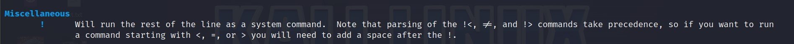
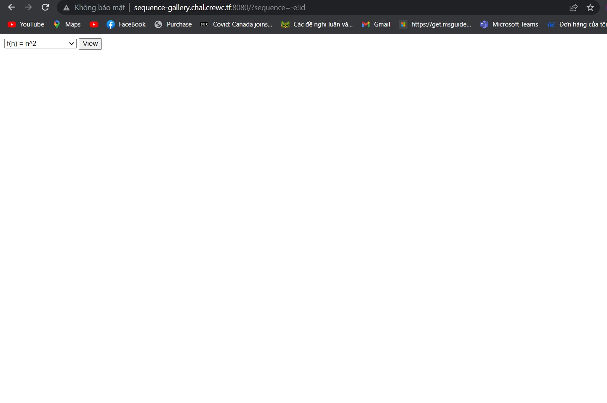
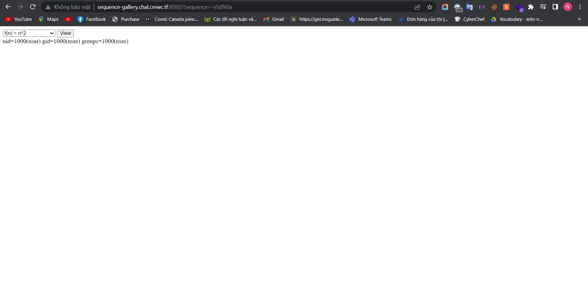
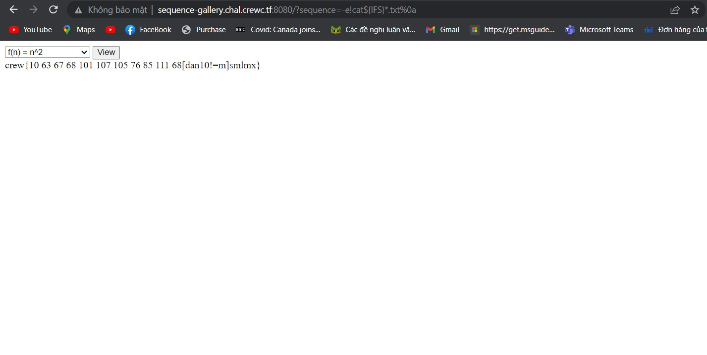

Today we will continue with the next challenge of CrewCTF.


# Challenge 1

Let's visit their provided website and see if there's anything interesting.
Hmm, it seems like a website that lists some special sequences, including n^2, n!, and the Fibonacci sequence.

Let's try to extract more information from the source code and see.
```
import os
import sqlite3
import subprocess

from flask import Flask, request, render_template

app = Flask(__name__)

@app.get('/')
def index():
	sequence = request.args.get('sequence', None)
	if sequence is None:
		return render_template('index.html')

	script_file = os.path.basename(sequence + '.dc')
	if ' ' in script_file or 'flag' in script_file:
		return ':('

	proc = subprocess.run(
		['dc', script_file], 
		capture_output=True,
		text=True,
		timeout=1,
	)
	output = proc.stdout

	return render_template('index.html', output=output)

if __name__ == '__main__':
	app.run(host='0.0.0.0', port=8080)
```
It appears that the website runs a program based on the value passed to the sequence variable, and it associates it with a file extension of .dc and then runs the dc command. It seems like we can exploit this by injecting commands through the sequence variable. However, the author has added two filters: space (" ") and "flag".
Let's first try to exploit Remote Code Execution (RCE).

It seems like we can execute commands, but how do we proceed from here? Let's learn more about it. I discovered something quite interesting.





It appears to be a command that allows us to execute pre-built expressions. However, with the exclamation mark ("!"), it's clear that we can exploit RCE :>. However, we still need to bypass the Web Application Firewall (WAF).



We can use "%0a" to bypass it.

So, we have successfully bypassed it. The remaining task is to retrieve the flag. To bypass the restrictions on " " and "flag", we can use some tricks like ${IFS} and "*".

