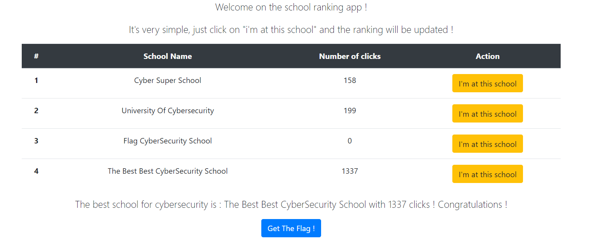
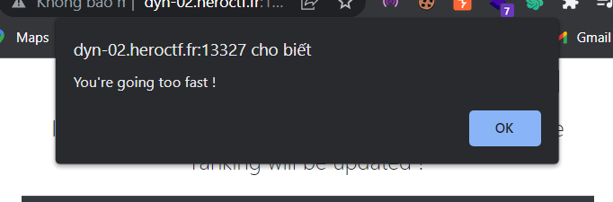
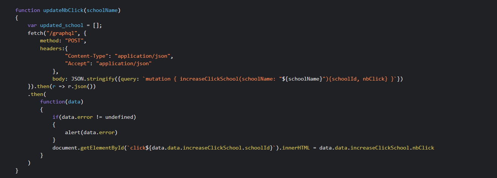
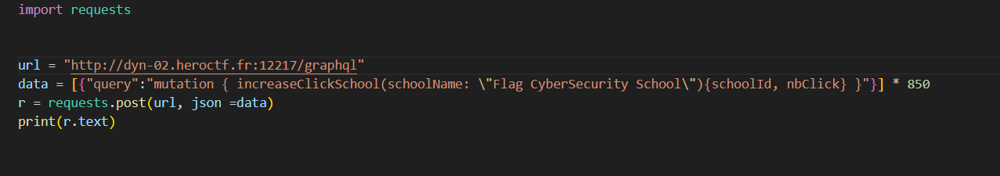
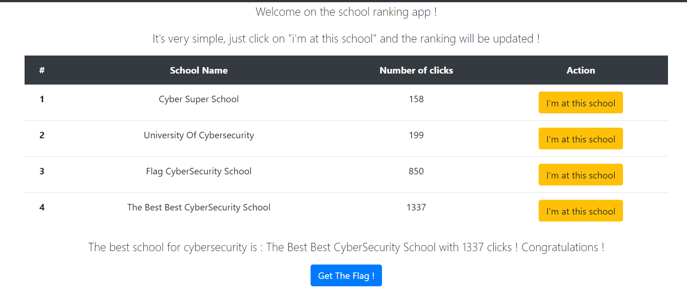
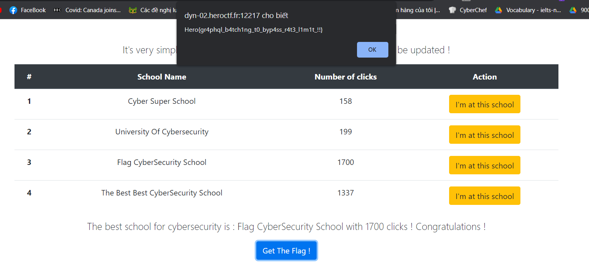

Description
An anonymous company has decided to publish a ranking of the best schools, and it is based on the number of clicks on a button! Make sure you get the 'Flag CyberSecurity School' in first place and you'll get your reward!

Format : Hero{flag}
Author : Worty

Challenge đầu tiên là Best Schools, cái nhìn đầu tiên mình thấy một trang web gồm 1 bảng xếp hạng các trường, mục đích là ta cần đưa Flag CyberSecurity School lên đầu và sau đó ta sẽ có được flag :>

Hmm... Có vẻ nếu ta nhấp vào "I'm at this school" thì "Number of clicks" sẽ tăng lên 1 tuy nhiên có vẻ trang web lại giới hạn thời gian giữa những lần click đó

Vào xem thử source code xem có gì nào

Mình tìm thấy một đoạn code có vẻ khai thác được !!! Có vẻ nó sẽ gửi một requests {"query":"mutation { increaseClickSchool(schoolName: \"Flag CyberSecurity School\"){schoolId, nbClick} }"} tới /graphql mỗi khi ta click vào button "I'm at this school". Challenge này có vẻ là về graphql và cách nó hoạt động. Tuy nhiên như đã nói ở trên có vẻ ta chỉ có thể gửi 1 requets một phút mỗi lần mà thôi, và gần như không thể vượt qua 1337 trong vòng 45 phút giới hạn của challenge (ban đầu mình còn định brute force cơ đấy :>). Sau một hồi suy nghĩ, mình nghĩ liệu mình có thể gửi nhiều requests trong một lúc được không, ta có thể sử dụng graphql batching để làm điều đó :>, requests có trong sẽ như thế này
[
    {
        "query":"..."
    },{
        "query":"..."
    }
    ,{
        "query":"..."
    }
    ,{
        "query":"..."
    }
    ...
]
Được rồi, time for eploxiting !!!
Tôi thử code một đoạn code như sau

Chạy thử và Boommmmmmmm :>

Vậy là chúng ta đã thành công, công việc bây giờ là chỉ cần đời 1 phút và gửi tiếp đoạn requests đó lần thứ 2

Ta đã có được flag : 
Hero{gr4phql_b4tch1ng_t0_byp4ss_r4t3_l1m1t_!!}