A friend of yours got into an argument with a flask developer. He tried handling it himself, but he somehow got his nose broken in the process… Can you put your hacker skills to good use and help him out?

You should probably be able to access the server hosting your target’s last project, shouldn’t you ? I heard is making a lost of programming mistakes…

Deploy on deploy.heroctf.fr

Format : Hero{flag}
Author : Log_s

Challenge tiếp theo là Drink from my Flask#1
Giải xong thì cũng hết cả thời gian cuộc thi luôn. Chán !!!!! Ở đây nó đưa ta tới một trang web như sau

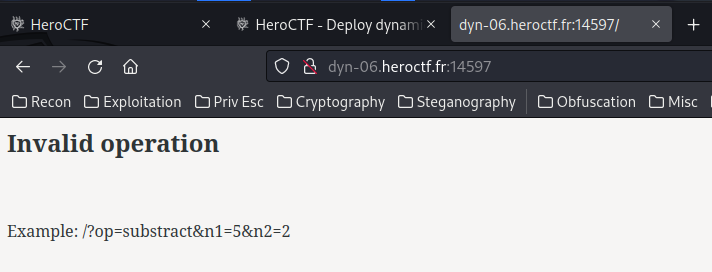

Ở đây chúng ta cần cung cấp 3 biến GET op, n1, n2, nếu không thì nó sẽ trả về "Invalid operation". Let's check Burp Suite 

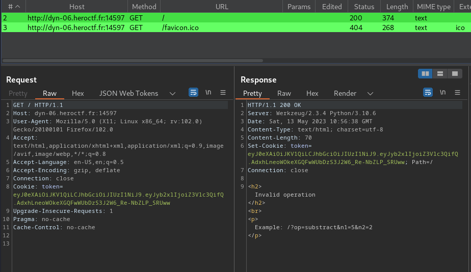

Khi ta tới "/", có vẻ nó tạo cho ta sẵn một cookie token, and nó có vẻ JWT token, try decode it:

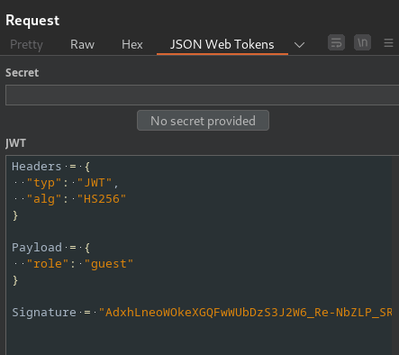

Như bạn có thể thấy là nó đang sử dụng thuật toán HS256, gồm HMAC + SHA256. Ở đoạn payload section, ta có một role claim, nó hiện tại được đặt giá trị là guest. Hmm... khó rồi đấy, vì HS256 là một thuật toán khóa ký đối xứng, ta có thể brute force nó thể tìm signing secret. Tôi sử dụng jwt.tool

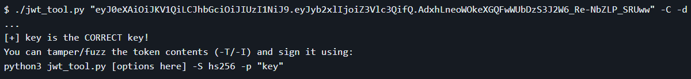

Nice!!! Có vẻ ta thành công crack được secret là key
Nhưng mà khoan đã ngay từ đầu ta đã được set vai trò là guest có vẻ điều đó là chưa đủ để khai thác nên tôi thử đổi vai trò là admin và dùng jwt.io

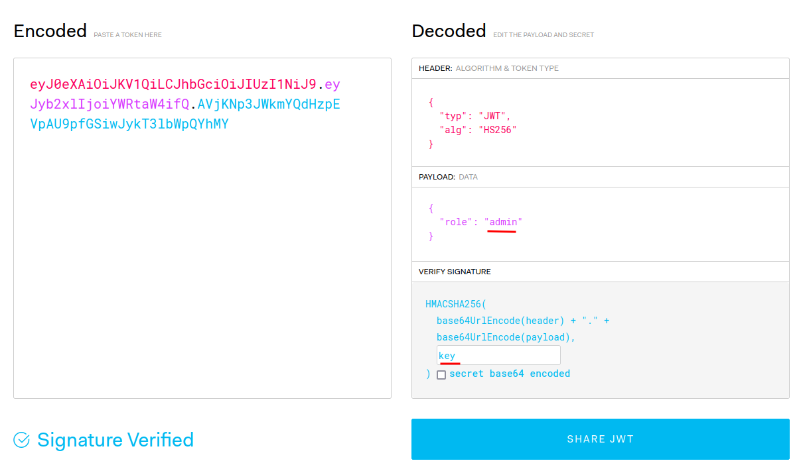

Boom !!! Tôi đã được set với vai trò là admin, nhưng mà không thấy flag đâu. Tôi ngồi loay hoay một lúc, thử XSS vào role xem như nào

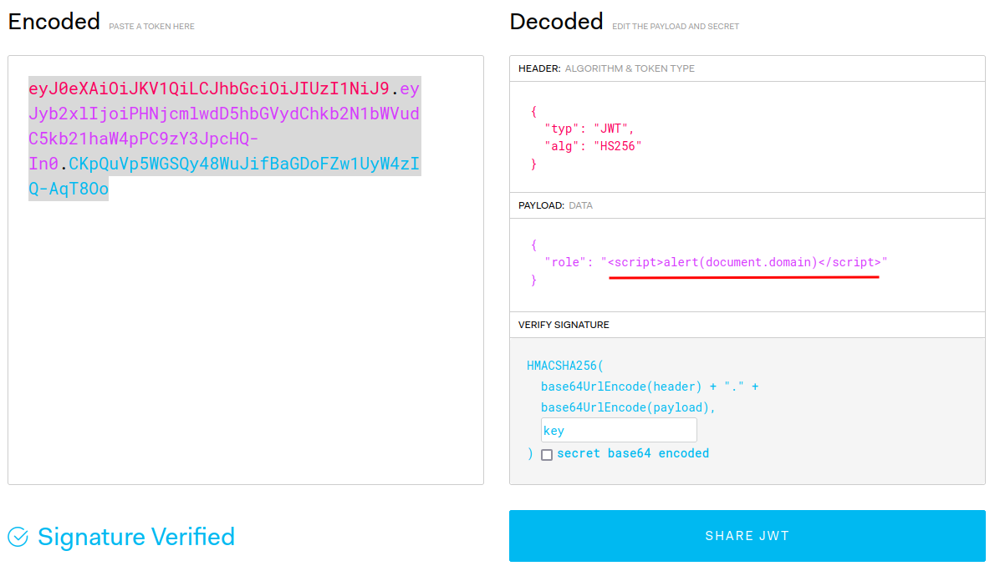

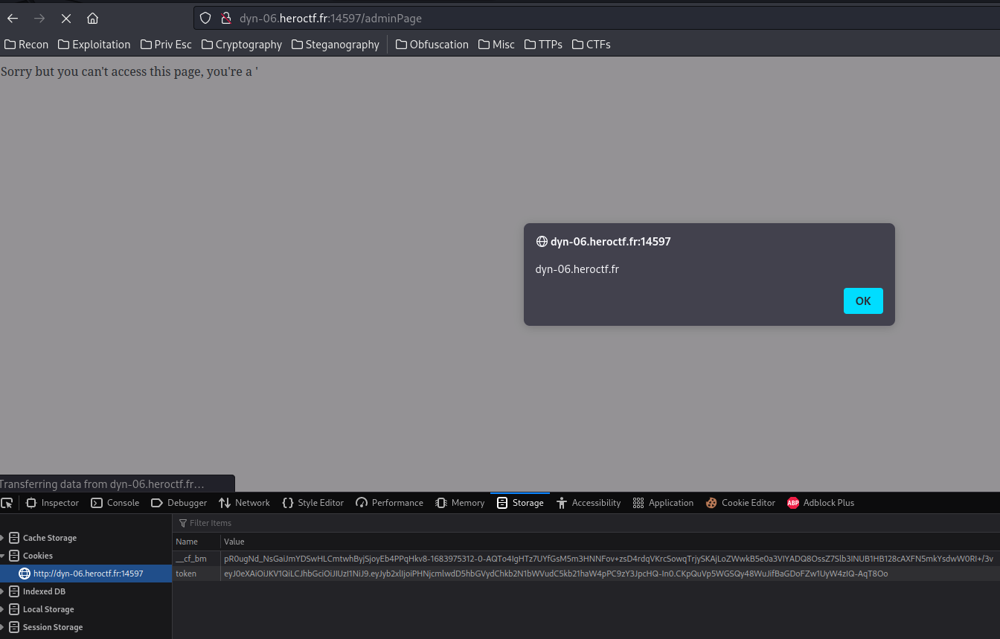

Tôi đã đúng có vẻ có thể khai thác được thông qua cách này, nhưng khó khăn bắt đầu ở đây, tôi thử các payload xss img, svg,... vẫn không thành công nó xuất hiện lỗi "Anoramly long payload", tôi gần như cạn ý tưởng non kinh nghiện nó thế :<<<<. Nhưng khoan đã SSTI thì sao đề bài là Drink form my Flask mà tôi thử xem nó sử dụng template engine gì và cuối cùng nó có vẻ là "Jinja2" 

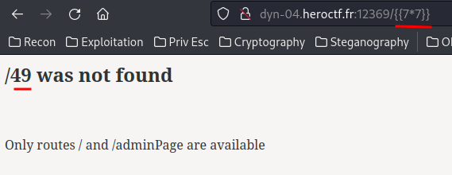

Time for eploxiting
Theo Hacktricks, ta có thể RCE thông qua payload sau:

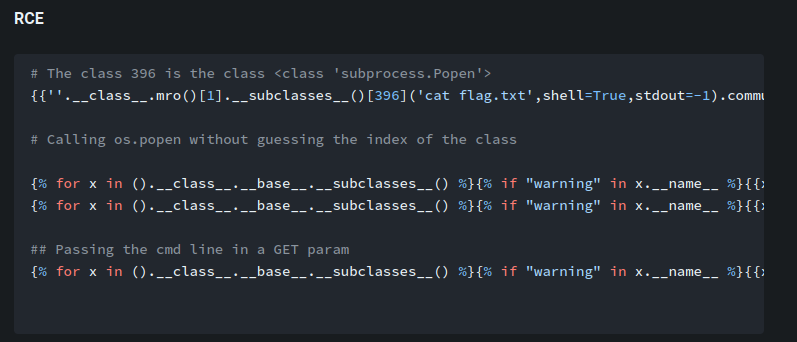

Tuy nhiên tôi đã thử và nó vẫn trả về lỗi đã kể ở trên. Đến đây là hơi mệt nha, có vẻ nó giới hạn kí tự payload của chúng ta, thử qua /adminPage thì sao và Oh my god :> nó được.

Vậy thì đơn gian là chèn RCE vào role để khai thác thôi

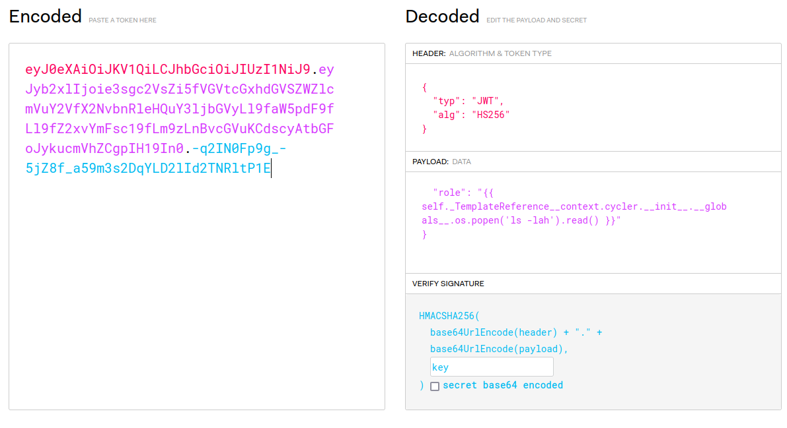

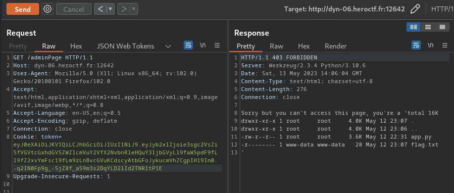

Lấy flag thôi nào !!!

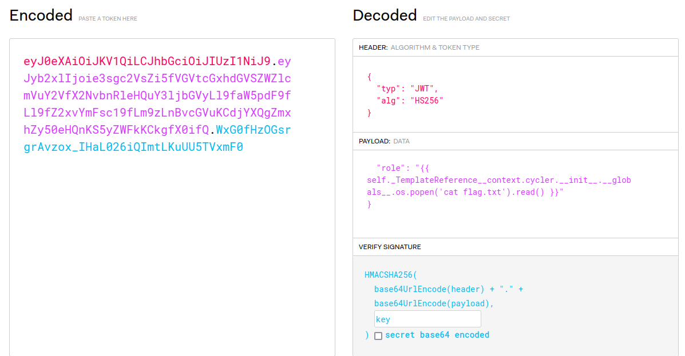

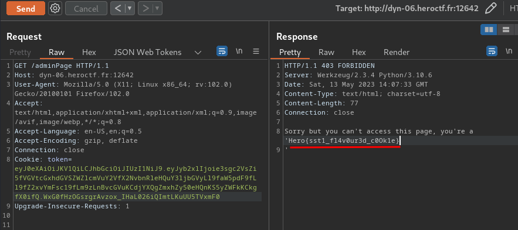

Flag là Hero{sst1_fl4v0ur3d_c0Ok1e}

What we’ve learned:

Cracking JWT Secret & Exploiting RCE Via SSTI