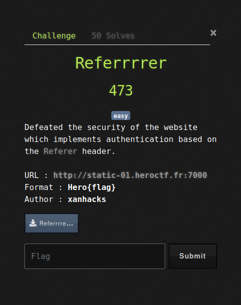
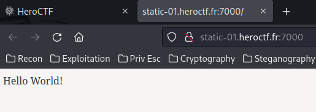
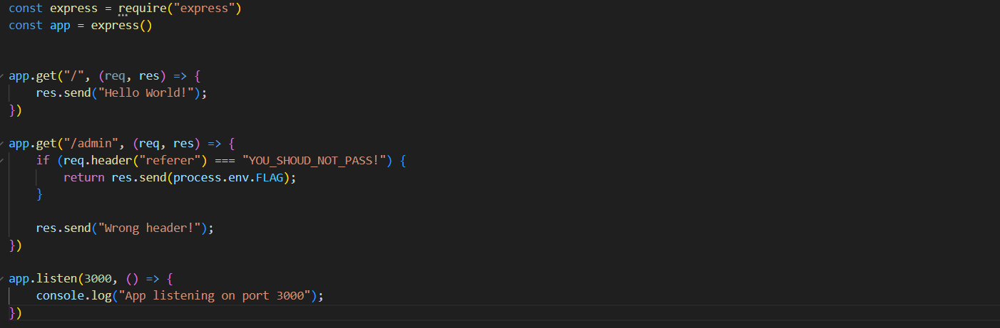
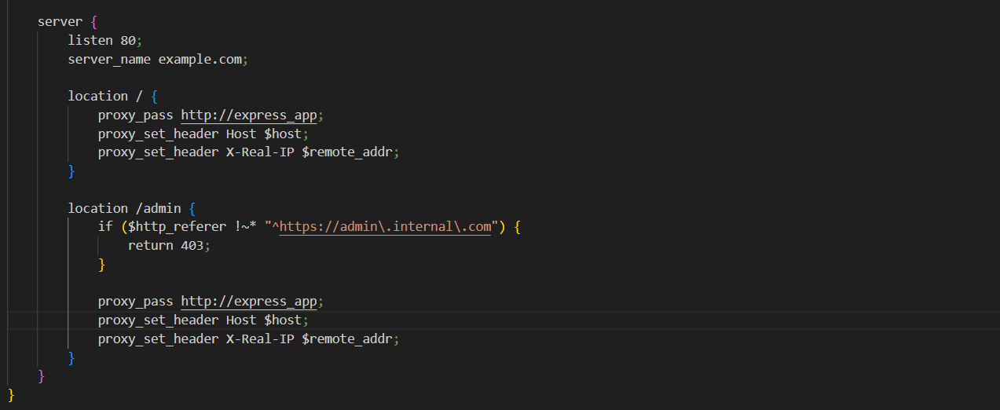
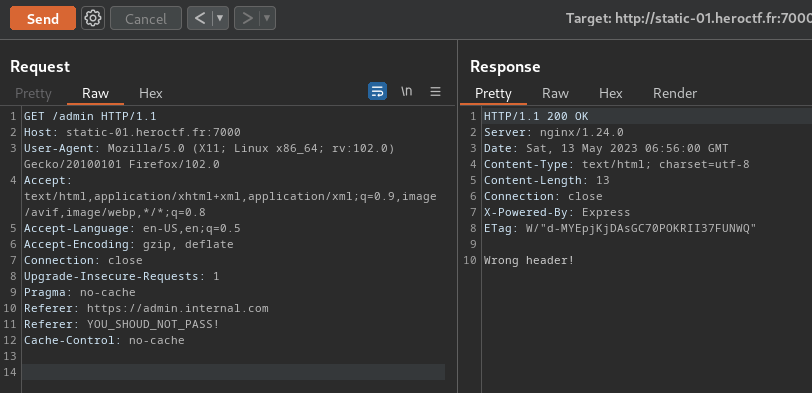
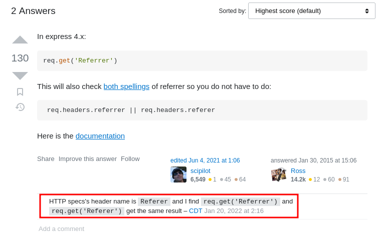
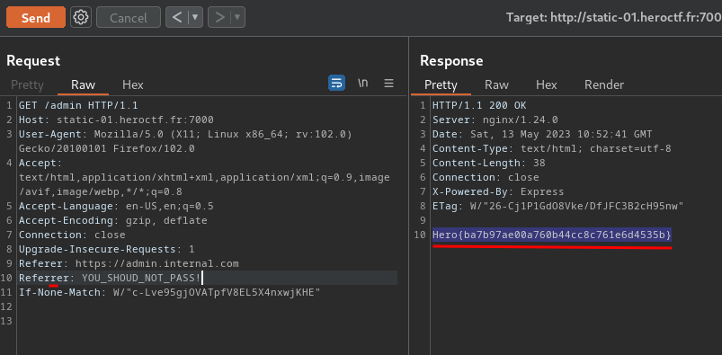

Description
Defeated the security of the website which implements authentication based on the Referer header.

Format : Hero{flag}
Author : xanhacks

Challenge tiếp theo là Referrrrer, cái challenge này mình cũng tốn kha khá thời gian vì mới tập tành chơi CTF :<
OK không sao bài nó cho mình có vẻ là source code của nó hãy tải về nào 

Nào cùng đi tới trang web tôi:  http://static-01.heroctf.fr:7000

Nhìn trang web có mỗi Hello World! xem ra không khai thác được điều gì rồi :<, ta đi tới file .zip đã tải về thôi nào. 
Ở app/index.js, ta có thể thấy:

Ồ như ta có thể thấy nếu ta gửi GET request tới /admin, nếu Referer là YOU_SHOULD_NOT_PASS!, nó sẽ trả lại cho chúng ta flag. Có vẻ dễ ha, nhưng đời không như mơ lúc tôi dùng Burp Suite thử gửi request thì Bam!!!! Status_code is 403 
"Không dễ như thế đâu đừng có mơ" Tác giả said :>

Xem source code kĩ lại một chút tôi phát hiện ra file server ngnix :>, ban đầu tôi không để ý, đúng là dụng tốc bất đạt :>

Có vẻ ta phải gửi 2 Referer header với hai giá trị là https://admin.internal.com AND YOU_SHOUD_NOT_PASS!?
Tuy nhiên, khi tôi thử gộp 2 Referer đó lại trong /admin request, nó lại trả về "Wrong header!"

Sau khi ngồi tìm kiens tôi tìm được vài thứ hay ho:

Có vẻ như ta có thể thay thế Referer bằng Referrer mã vẫn trả ra cùng kết quả :>. Tôi thử nó với Burp Suite và Boom!!! We get flag:

Flag là Hero{ba7b97ae00a760b44cc8c761e6d4535b}
What we’ve learned:

Exploiting Referer-based Access Control In Node.js Express