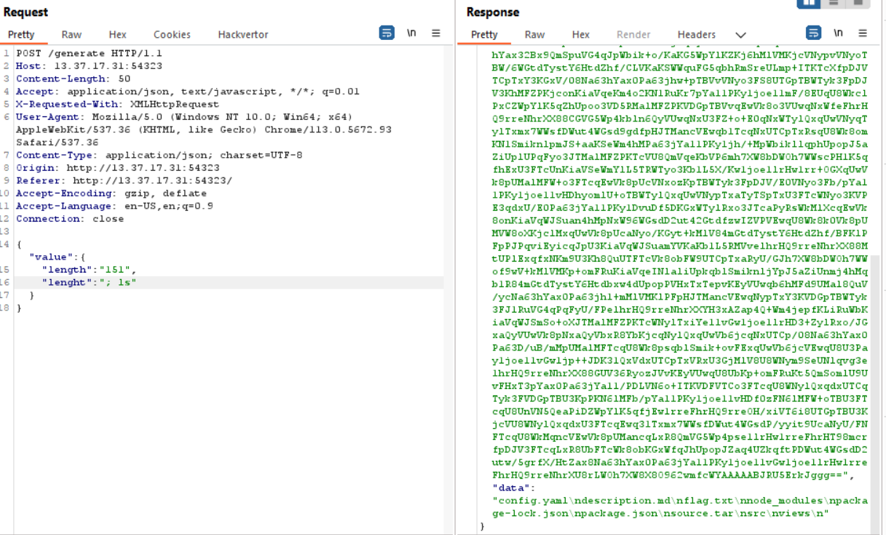

Đây là challenge thứ hai của giải PWNME - 8 bits, ừm cũng mất một lúc mình mới có thể giải được nó :>, chỉ tại không để ý một chút :<
Được rồi vào xem yêu cầu của bài nào:

H xem web như thế nào, click vào link thôi

Có vẻ như là một trình tạo qr code online thì phải, nó yêu cầu số kí tự mình nhập không được vượt quá 150, hừm có vẻ có thể đây là mấu chốt để giải challenge này. Vào xem source code mà tác giả cung cấp xem nào

Mình tìm thấy một đoạn code rất thú vị ở đây có vẻ nếu nhập chuỗi có độ dài lớn hơn 150 nó sẽ tự set lại giá trị là null và nhận vào độ dài của chuỗi, sau đó thực thi lệnh getImange(). Cùng xem hàm getImage() nào

Như vậy là nếu giá trị là null thì hàm getImage() sẽ thực thi lệnh execFortune()

Ok có vẻ tôi bắt đầu tìm ra vấn đề rồi xem hàm execFortune nào 

Đúng như tôi đoán có vẻ hàm này sẽ nhận giá trị độ dài của chính chuỗi chúng ta truyền vào và hệ thống sẽ thực hiện lện "fortune -n". Đúng như dự đoán của mình có thể ta có thể thực thi RCE ở đây :>. Vậy bắt tay vào khai thác thôi!!!
Ý tưởng của mình là ban đầu ta sẽ truyền vào một chuỗi có độ dài là 151 và chèn thêm câu lệnh "; cat /app/flag.txt", hãy thực hiện nào

Tuy nhiên có vẻ nó không ổn, nó vẫn trả về một json báo error. Ngồi xem lại source code một lúc thì mình chợt nhận ra, khoan đã có vẻ lúc set lại giá trị Qrcode tác giả đã đánh sai chính tả length -> lenght thì phải. Ủa, sai sót hả, này sao chơi, ơ khoan đã đây là CTF mà có thể tác giả cố tình chăng :>

Có vẻ ta có thể khai thác được cái gì đó ở đây, phải rồi, hàm nhận value.length > 150 rồi mới set lại giá trị của chuỗi mình nhập vào, nếu mình truyền cả hai giá trị "length" và "lenght" thì sao và BOOM !! Mình đã có được flag

