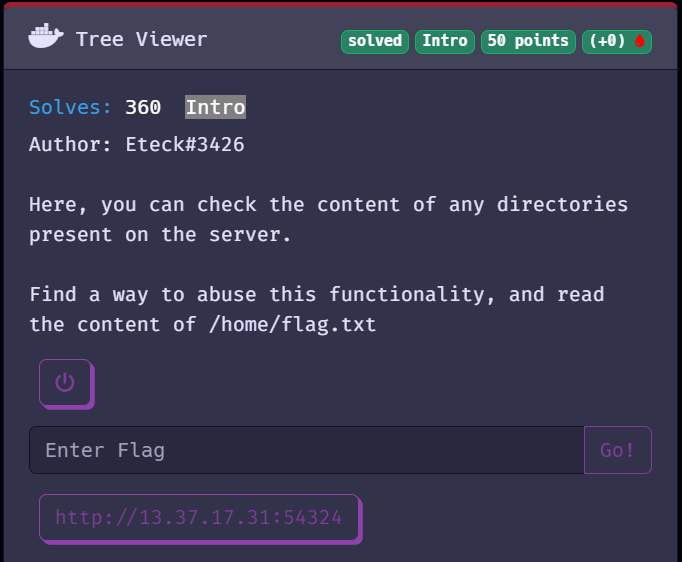
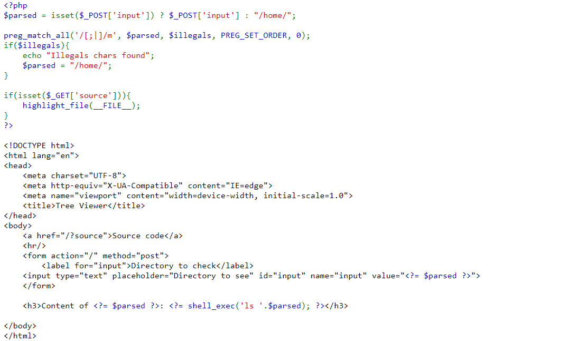
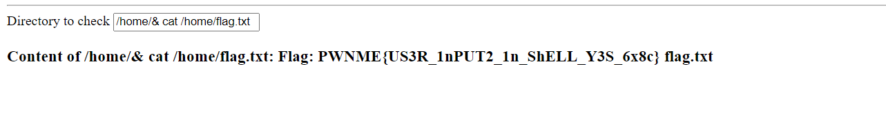

Đây là challenge đầu tiên của giải PWNME - 8 bits cùng vào xem đề bài nào

Vào trang web họ cung cấp thôi nào

Một challenge khá đơn giản, ta chỉ cần truyền chuỗi vào và server sẽ thực thi lệnh "ls", ok rõ ràng là RCE, đơn giản là mình truyền payload "&cat /home/flag.txt" và lấy flag thôi 

