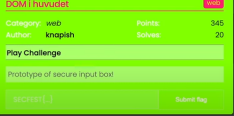
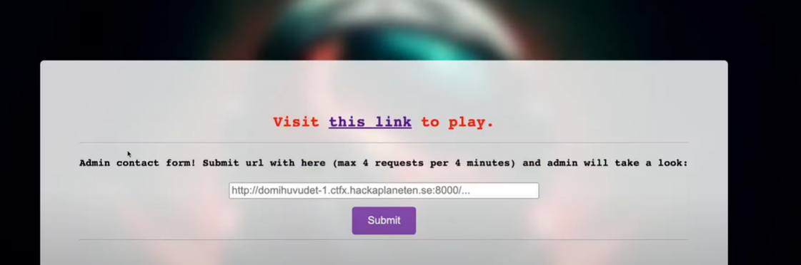
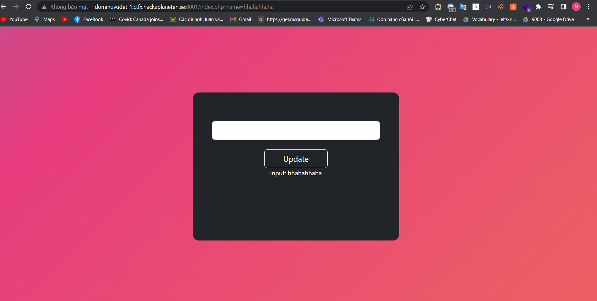
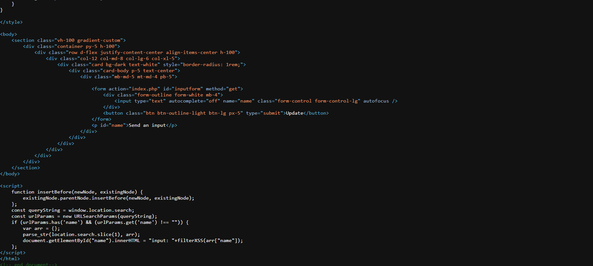
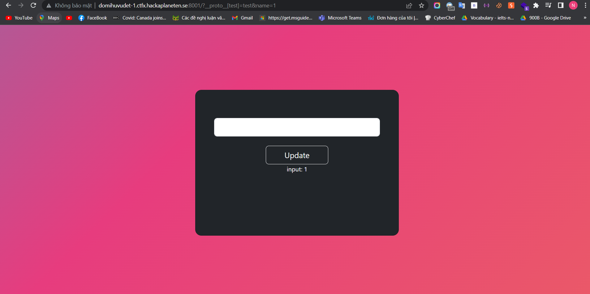
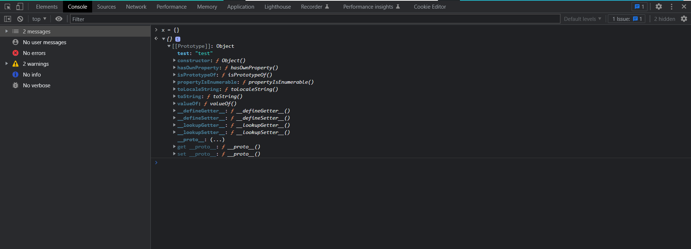
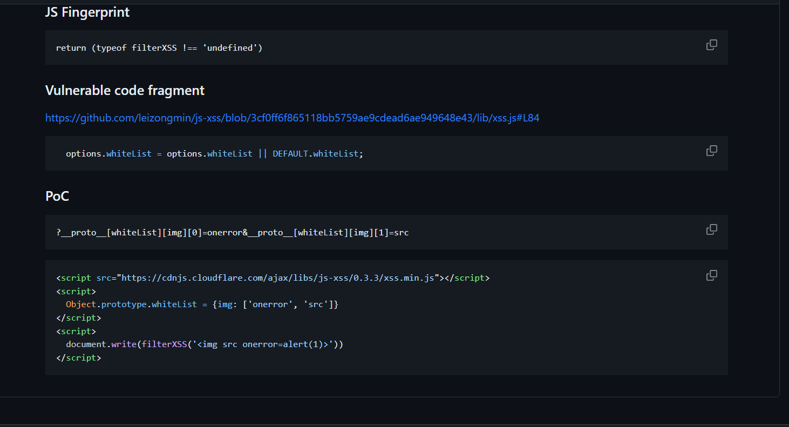
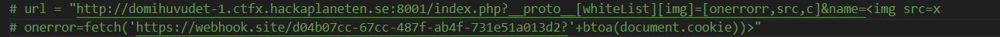
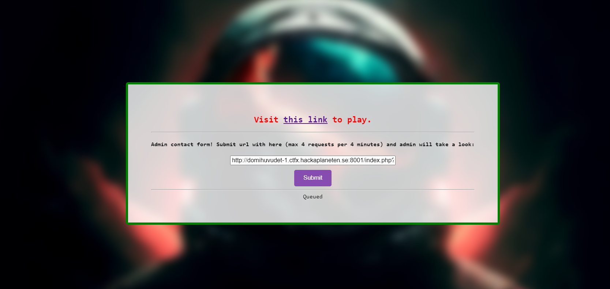
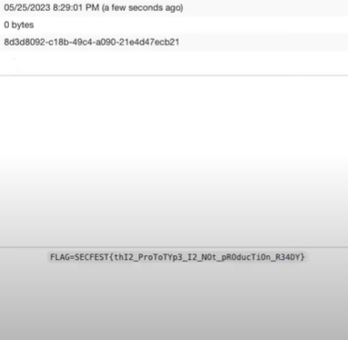

<<<<<<< HEAD
Challenge tiếp theo là dom... tên khó viết quá nên xem trên challenge nha :>>>

Đề cho ta một admin form yeah i think it very useful cùng vào trang web của bài nào 

Đề cho ta một form để update giá trị truyền vào input không có gì để khai thác cả :<.Vào xem source code coi nào

Có vẻ như ta input này filter XSS bằng cách tạo ra một white lists bằng cách tryền hàm filterXSS vào trường name chúng ta nhập, có vẻ khó khăn đây mình học xss chưa nhiều lắm, nhưng wait để bài nhắc tới prototype liệu có phải prototype polution không sau vài đường goole nhẹ mình tìm ra payload này 

It works có vẻ ta đã polute nó thành công !!!

Bây giờ chỉ cần thực thi XSS và lụm được flag thôi, tuy nhiên mình gặp khó trong việc tìm ra payloads thích hợp, cái này mù lắm :<, sau khi search mỏi tay thì mình cũng tìm được payloads đó :<

Có vẻ là ta sẽ thực theo các bước sau Client-Side Prototype Pollution > Utilizing the whiteList gadget > XSS. Yeah, mọi thứ đã thành công bây giờ chỉ cần đưa nó lên webhook để lấy cookies thôi

Và boom web got flag!!!

=======
Challenge tiếp theo là dom... tên khó viết quá nên xem trên challenge nha :>>>

Đề cho ta một admin form yeah i think it very useful cùng vào trang web của bài nào 

Đề cho ta một form để update giá trị truyền vào input không có gì để khai thác cả :<.Vào xem source code coi nào

Có vẻ như ta input này filter XSS bằng cách tạo ra một white lists bằng cách tryền hàm filterXSS vào trường name chúng ta nhập, có vẻ khó khăn đây mình học xss chưa nhiều lắm, nhưng wait để bài nhắc tới prototype liệu có phải prototype polution không sau vài đường goole nhẹ mình tìm ra payload này 

It works có vẻ ta đã polute nó thành công !!!

Bây giờ chỉ cần thực thi XSS và lụm được flag thôi, tuy nhiên mình gặp khó trong việc tìm ra payloads thích hợp, cái này mù lắm :<, sau khi search mỏi tay thì mình cũng tìm được payloads đó :<

Có vẻ là ta sẽ thực theo các bước sau Client-Side Prototype Pollution > Utilizing the whiteList gadget > XSS. Yeah, mọi thứ đã thành công bây giờ chỉ cần đưa nó lên webhook để lấy cookies thôi

Và boom web got flag!!!

>>>>>>> 17817521172f8c24636d12642068cab4d4809d84
