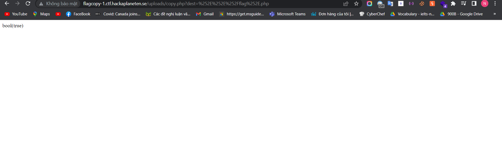
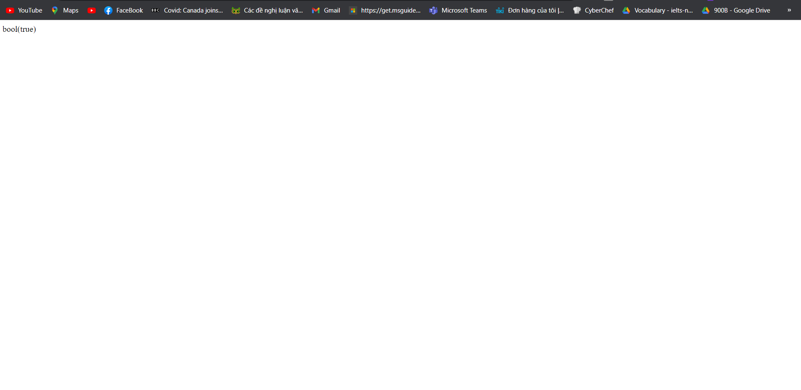

Challenge đầu tiên là flagcopy ok cùng vào trang web xem ta có gì nào 

Ok khá đơn giản ta có hai nút là Copy flags here và Source code. Ta thử vào source code thấy được gì

Yeah có vẻ như ta phải truyền tham số dest để ghi đè đường dẫn của tệp flag.php nếu vượt qua thành công filter thì ta chỉ cần truyền lại path mà chúng ta đã chèn và lấy được flag thôi. Ý tưởng là vậy, cùng thực hiện thôi 

Có vẻ chúng ta đã truyền thành công bây giờ quay trở lại để xem thu hoạch được gì nào

Ồ có vẻ nó chuyển hướng chúng ta tới trang web ban đầu nhưng có vẻ url đã thay đổi sau một hồi suy nghĩ thì có vẻ ta phải bypass qua lần lượt path nêu trên cũng với đường dẫn ta đã tạo

It worked !!! Và nó tiếp tục đưa ta tới trang web ban đầu nhưng đường dẫn khác yeah có vẻ đây là cái cuối cùng, thực hiện lại nào

Và boom ta có được flag :>

À thực ra bonus thêm là có vẻ như tác giả không set lại đường dẫn mà những người chơi khác đã thực hiện nên nếu dùng dirseach chúng ta cũng có thể lấy được flag 

Bật mí nhỏ là ban đầu mình làm thế này nhưng nó hacker lỏd quá nên viết WU phải ngầu cho có kiến thức :>