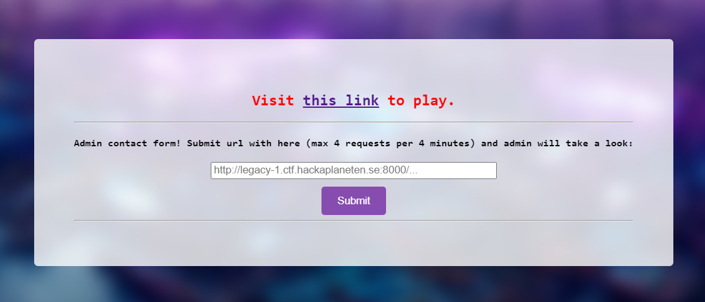
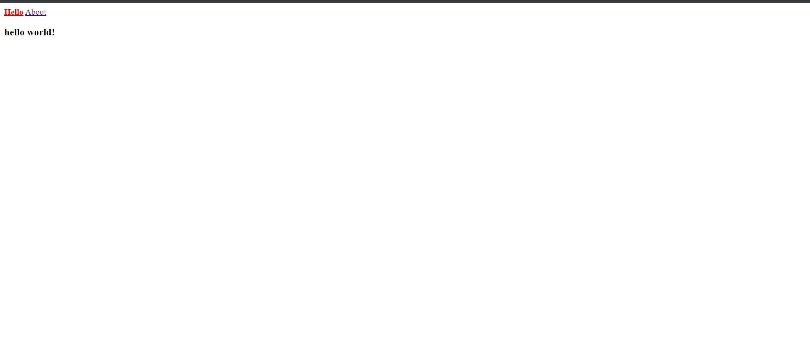
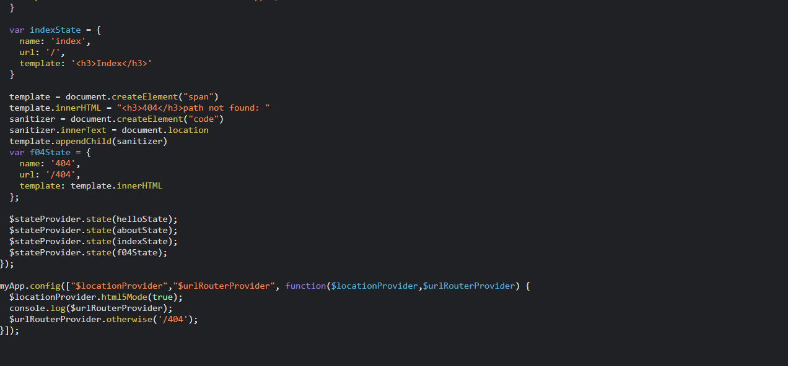
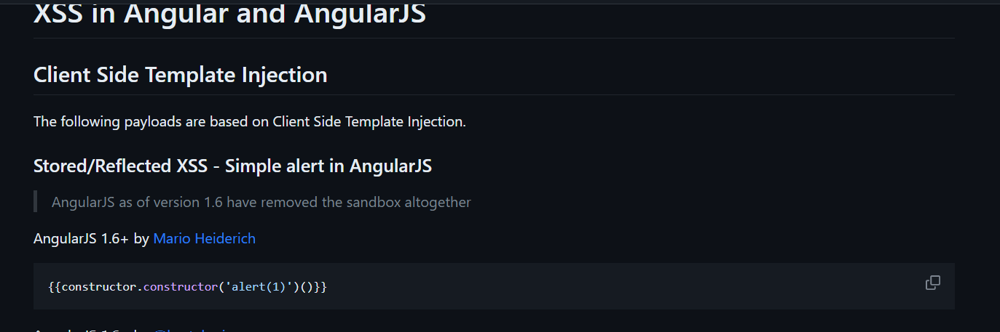
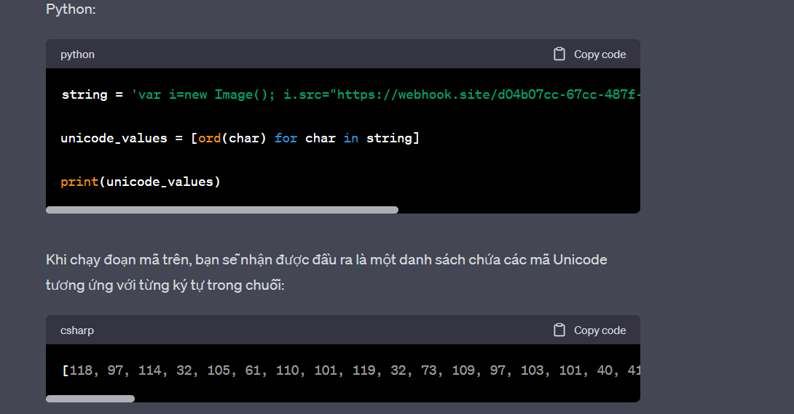
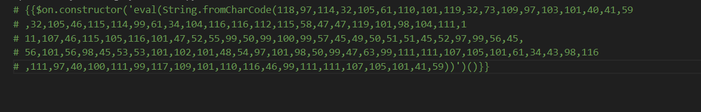
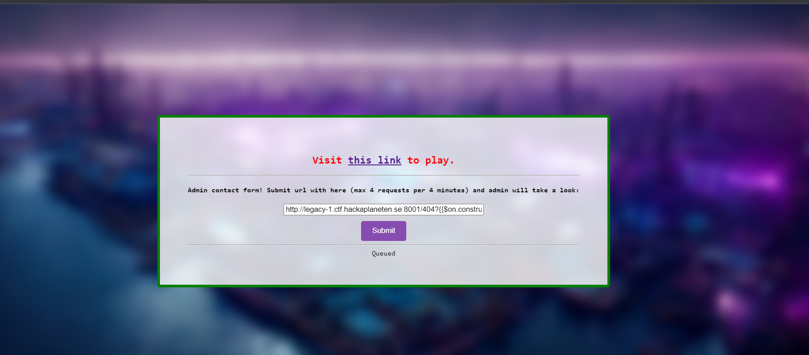
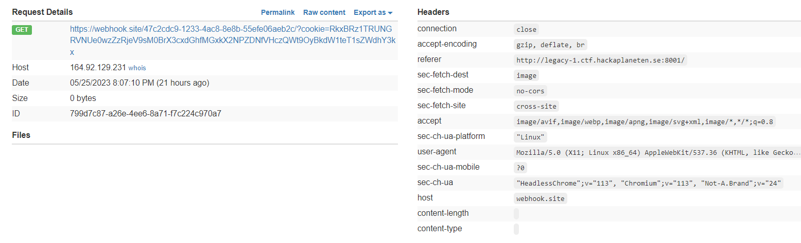
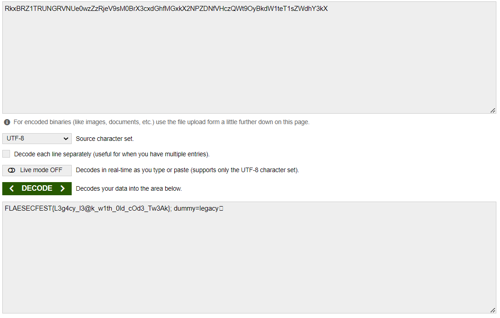

<<<<<<< HEAD
Challenge cuối cùng mình giải được là legacy. Ok vào link tác giả cung cấp thôi

Có vẻ giống cái dom... có vẻ chúng ta lại được cho một admin form. Vào link để xem challenge này có gì nào

Yeah có vẻ chỉ là một trang web bình thường thôi, ta vào thử xem source code có gì nào

Nó cung cấp cho chúng ta một cookie build sẵn là dummy:legacy, yeah, đưa cho chúng ta 3 template là hello, about và 404 như bạn có thể thấy duy chỉ có 404 là có thể nhập được input vào thôi, mình đã nghĩ ngay tới việc XSS cộng với việc nó được viết bằng AngularJS nên ta có payload sau 

Yeah nhưng có vẻ trang web nó có một filter XSS khiến chúng ta không thể thực thi được XSS, nhưng nếu ta thực hiện mã hóa nó dưới dạng Unicode thì sao, tôi đã cào phím với chatGPT và đây là kết quả mà mình nhận được

Ok thử với admin form xem có thành công không nào và boom chúng ta đã nhận được flag :>

=======
Challenge cuối cùng mình giải được là legacy. Ok vào link tác giả cung cấp thôi

Có vẻ giống cái dom... có vẻ chúng ta lại được cho một admin form. Vào link để xem challenge này có gì nào

Yeah có vẻ chỉ là một trang web bình thường thôi, ta vào thử xem source code có gì nào

Nó cung cấp cho chúng ta một cookie build sẵn là dummy:legacy, yeah, đưa cho chúng ta 3 template là hello, about và 404 như bạn có thể thấy duy chỉ có 404 là có thể nhập được input vào thôi, mình đã nghĩ ngay tới việc XSS cộng với việc nó được viết bằng AngularJS nên ta có payload sau 

Yeah nhưng có vẻ trang web nó có một filter XSS khiến chúng ta không thể thực thi được XSS, nhưng nếu ta thực hiện mã hóa nó dưới dạng Unicode thì sao, tôi đã cào phím với chatGPT và đây là kết quả mà mình nhận được

Ok thử với admin form xem có thành công không nào và boom chúng ta đã nhận được flag :>

>>>>>>> 17817521172f8c24636d12642068cab4d4809d84
