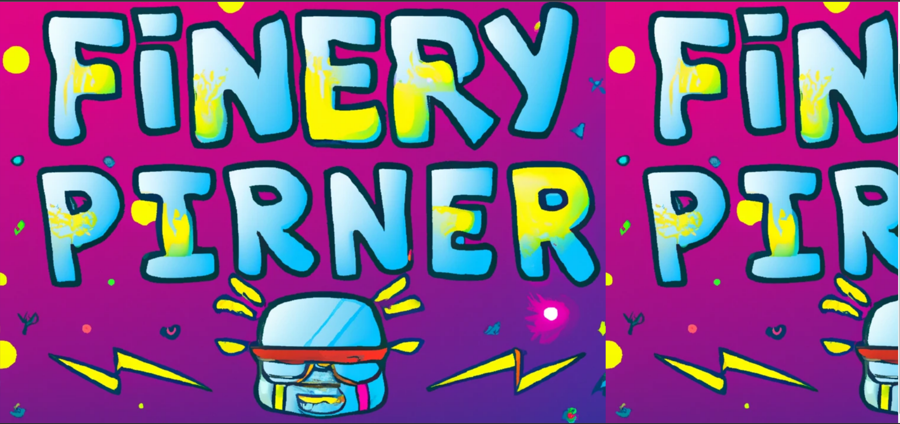

Description
You are invited to a front-end party! This is an opportunity for us to get together, network, and share our passion for front-end development. Whether you're a seasoned pro or just getting started, we welcome you to join us for an evening of fun and learning.

We'll have food and drinks, music, and plenty of opportunities to mingle with other front-end enthusiasts. We'll also have some exciting presentations and demos from experts in the field, as well as a chance to showcase your own projects.

We have the web like this

Vào xem source code chúng ta nhận được một đoạn code rất là wow amazing 

Có vẻ là một đoạn code is **obfuscate**, yeah để thế này thì chúng ta khó mà đọc được nên mình sử dụng tool để convert nó thành mã JS: https://deobfuscate.relative.im/

Sau khi **deobfuscate** chúng ta nhận được đoạn code sau, mình chú ý đến đoạn mã base64 được đặt trong đoạn code

Thử giải mã xem chúng ta nhận được gì nào 

Và có vẻ lại là một đoạn code **obfuscate** nữa, tiếp tục dịch lại về mã JS thôi

Có vẻ flag sẽ được mã hóa trong biến key, và chúng ta sẽ có được flag ban đầu bằng cách sử dụng phép XOR với các số được lưu trong mảng array, công việc bây giờ là chạy đoạn code trên và lấy flag thôi

Boom we get the flag

