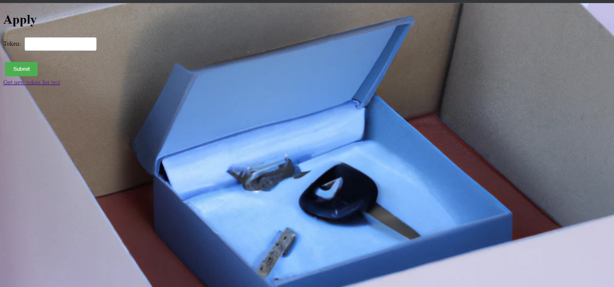
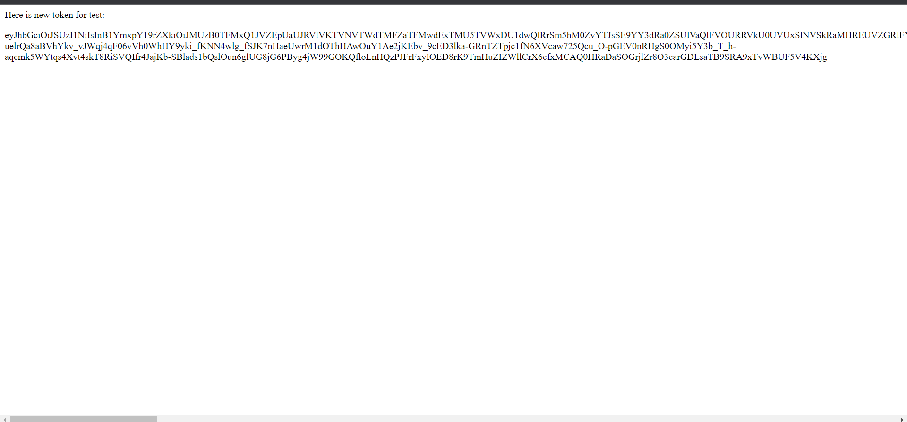
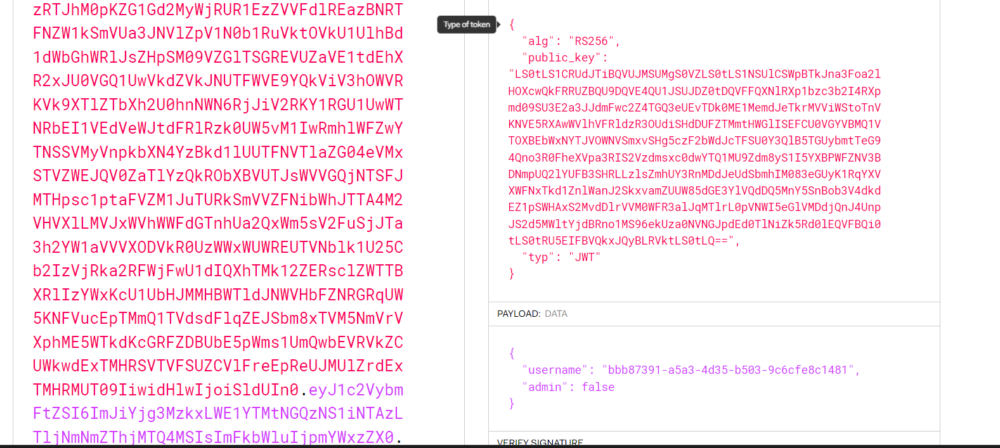
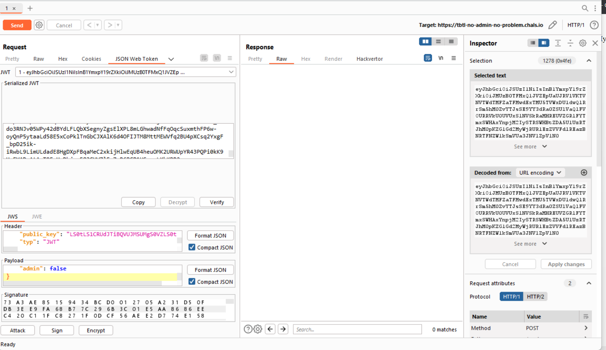
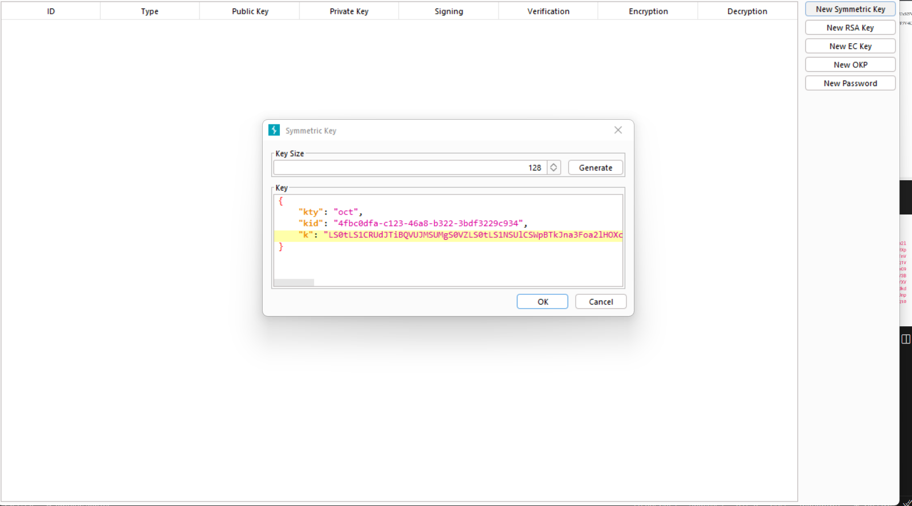
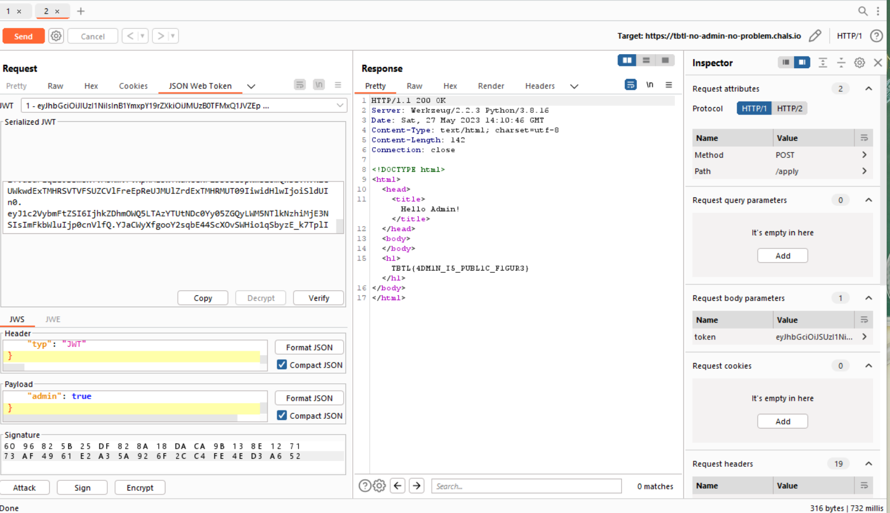

<<<<<<< HEAD
Description
In our current setup, we only have a testing environment and do not have any implementation for granting admin access.


Challenge tiếp theo là no_admin_no_problem





Có vẻ giống như một trang web tạo token thì phải, thử vào source code tác giả cung cấp xem chúng ta có thể khai thác được điều gì không 


```from flask import Flask, request, render_template
from fast_jwt import encode, decode
import uuid
import base64

app = Flask(__name__)


@app.route('/', methods=['GET'])
def index():
    return render_template('index.html')


@app.route('/apply', methods=['POST'])
def apply():
    token = request.form.get('token')

    public_key = open('publickey.crt', 'br').read()

    reason = ''
    try:
        decoded = decode(token, public_key)
    except Exception as e:
        reason = str(e)
        decoded = None

    fail = decoded is None or 'username' not in decoded or 'admin' not in decoded

    message = 'Test success:' + str(decoded) if not fail else 'Test failed! ' + reason

    if not fail and decoded['admin'] is True:
        return render_template('flag.html')

    return render_template('user.html', message=message)


@app.route('/get_token', methods=['GET'])
def get_token():
    private_key = open('keypair.pem', 'br').read()
    public_key = open('publickey.crt', 'br').read()
    public_key = base64.b64encode(public_key.replace(b'\n', b'')).decode('ascii')
    username = str(uuid.uuid4())
    payload = {'username': username, 'admin': False}
    encoded = encode(payload, private_key, 'RS256', public_key)
    return render_template('token.html', token=encoded)
```


Có vẻ trang web sẽ tạo cho ta ngẫu nhiên bằng JWT token nếu chúng ta chưa có token, và để lấy được flag ta phải set giá trị admin thành true và vượt qua việc verify của RS256, hừm có vẻ khá khó vì chúng ta không biết được private_key và public_key


Nhưng tôi có ý tưởng là nếu chúng ta set lại alg là HS256 và dùng burp suite tạo ra một key mới thì sao :>, liệu chúng ta có thành công hay không

Hãy thử tạo một JWT token xem nào



Thử decode lại nó bằng jwt.io xem nào 




Như mình đã nói giá trị admin sẽ tự đọng set thành false bây giờ chúng ta cần set lại thành true và verify thành công khóa


Vào burp suite xem nào 




Chúng ta set lại key và đổi alg HS256, sau đó set admin là true


Và boom wet get the flag 







=======
Description
In our current setup, we only have a testing environment and do not have any implementation for granting admin access.


Challenge tiếp theo là no_admin_no_problem


Có vẻ giống như một trang web tạo token thì phải, thử vào source code tác giả cung cấp xem chúng ta có thể khai thác được điều gì không 


```from flask import Flask, request, render_template
from fast_jwt import encode, decode
import uuid
import base64

app = Flask(__name__)


@app.route('/', methods=['GET'])
def index():
    return render_template('index.html')


@app.route('/apply', methods=['POST'])
def apply():
    token = request.form.get('token')

    public_key = open('publickey.crt', 'br').read()

    reason = ''
    try:
        decoded = decode(token, public_key)
    except Exception as e:
        reason = str(e)
        decoded = None

    fail = decoded is None or 'username' not in decoded or 'admin' not in decoded

    message = 'Test success:' + str(decoded) if not fail else 'Test failed! ' + reason

    if not fail and decoded['admin'] is True:
        return render_template('flag.html')

    return render_template('user.html', message=message)


@app.route('/get_token', methods=['GET'])
def get_token():
    private_key = open('keypair.pem', 'br').read()
    public_key = open('publickey.crt', 'br').read()
    public_key = base64.b64encode(public_key.replace(b'\n', b'')).decode('ascii')
    username = str(uuid.uuid4())
    payload = {'username': username, 'admin': False}
    encoded = encode(payload, private_key, 'RS256', public_key)
    return render_template('token.html', token=encoded)
```


Có vẻ trang web sẽ tạo cho ta ngẫu nhiên bằng JWT token nếu chúng ta chưa có token, và để lấy được flag ta phải set giá trị admin thành true và vượt qua việc verify của RS256, hừm có vẻ khá khó vì chúng ta không biết được private_key và public_key


Nhưng tôi có ý tưởng là nếu chúng ta set lại alg là HS256 và dùng burp suite tạo ra một key mới thì sao :>, liệu chúng ta có thành công hay không

Hãy thử tạo một JWT token xem nào


Thử decode lại nó bằng jwt.io xem nào 


Như mình đã nói giá trị admin sẽ tự đọng set thành false bây giờ chúng ta cần set lại thành true và verify thành công khóa


Vào burp suite xem nào 


Chúng ta set lại key và đổi alg HS256, sau đó set admin là true


Và boom wet get the flag 


>>>>>>> 7537baaa6b0ee606b1959230b1fa3812bd3ded8e
