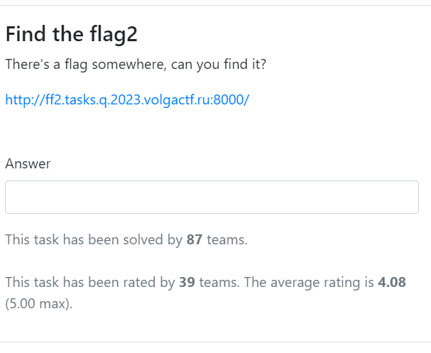
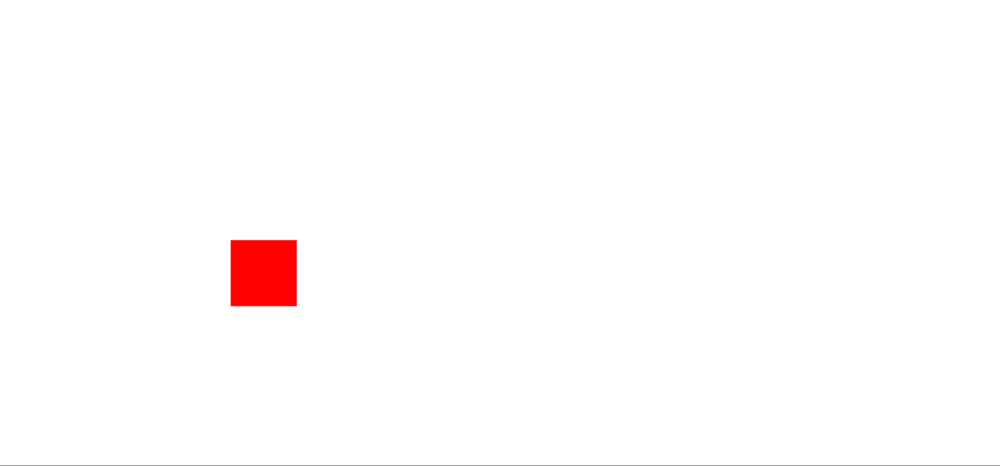
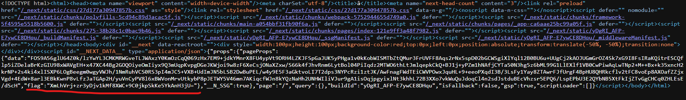
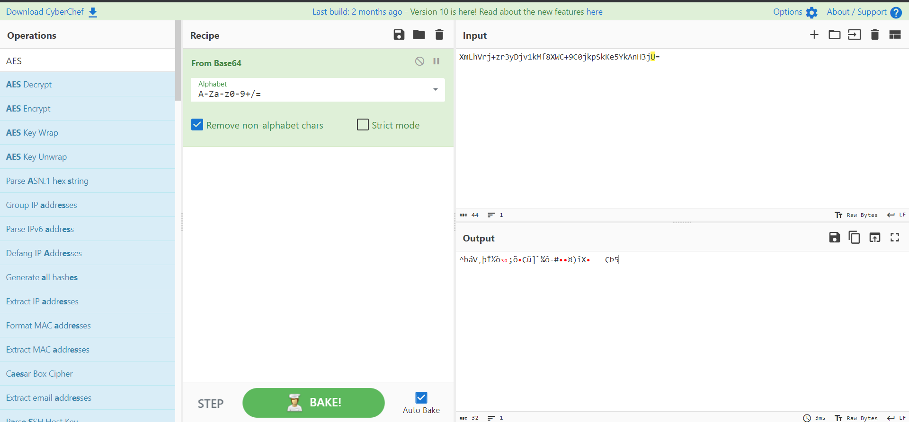
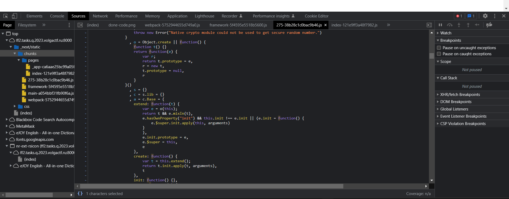
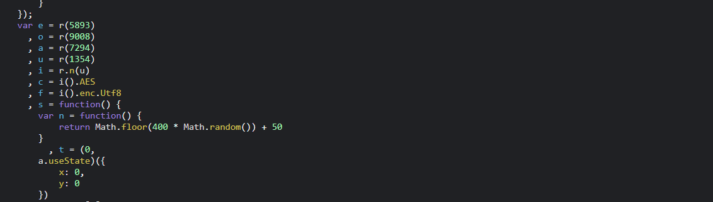
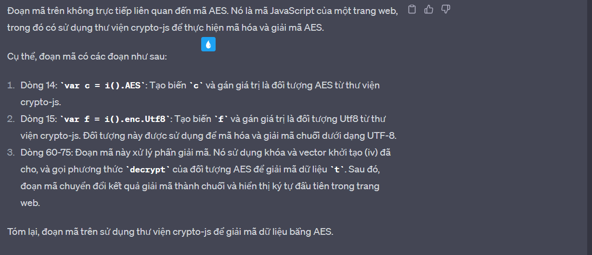
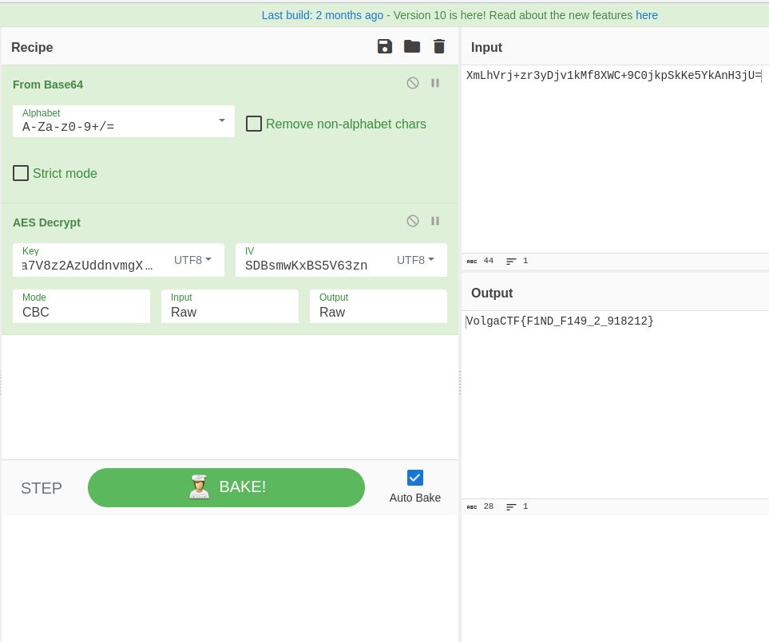

Description:
Find the flag2
There's a flag somewhere, can you find it?

http://ff2.tasks.q.2023.volgactf.ru:8000/

Tiếp tục series giải CTF trong hoang mang hôm nay là một giải hơi đau não nữa :<, chắc mình phải luyện tập nhiều hơn mới được :<
Ok click vào link xem có gì ở trang web nào:

Hừm, có vẻ chẳng có gì cả, đề bài là find the flag nên có vẻ khả năng flag được giấu ở đâu đó trong source code rồi :>

À há, nó đây rồi vừa mở ra đã thấy flag có vẻ là một đoạn mã base64 thử dùng cyberchef decode xem nào :>. 

No, có vẻ đời không như mơ, mà trong giấc mơ của mình sao không bao giờ nghĩ ra được cách giải, có vẻ flag được mã hóa theo cách nào đó. Xong! mới học mà, động tới cryto thế này :<.
Thử xem trong file nguồn xem có thu hoạch được gì không nào

Sau một hồi tìm kiếm mình phát hiện ra một đoạn werid code có vẻ dùng để mã hóa cái gì đó. Và những cái gì không biết bây giờ ta làm gì, tra goole, OK một cách, nhưng chatGPT yeah!!! là nó, tôi thử hỏi chatGPT và đây là kết quả nhận được 

Ồ có vẻ flag được được mã hóa dưới dạng AES
Note: AES (Advanced Encryption Standard) là một thuật toán mã hóa đối xứng được sử dụng rộng rãi trong bảo mật thông tin. Nó được chọn làm tiêu chuẩn mã hóa bởi Chính phủ Hoa Kỳ từ năm 2001. AES hoạt động dựa trên việc chia dữ liệu thành các khối cùng kích thước và thực hiện một loạt các vòng lặp để mã hóa hoặc giải mã. Kích thước khối mặc định của AES là 128 bit, nhưng nó cũng hỗ trợ 192 bit và 256 bit.
Cyberchef chắc chắn là Cyberchef, sử dụng tool đó thôi nào và boom!!!, flag đây rồi :>

