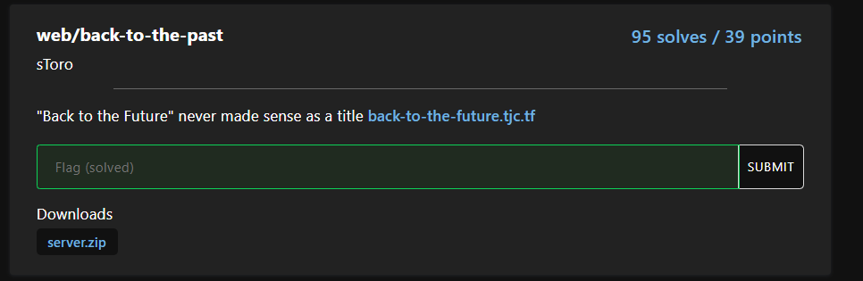
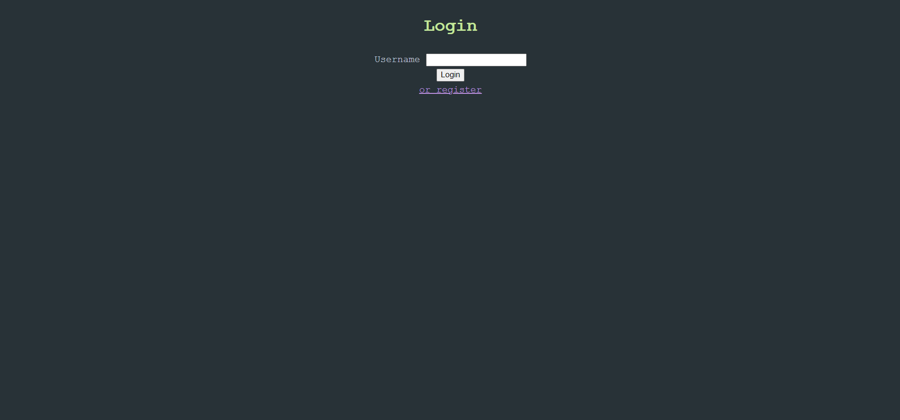
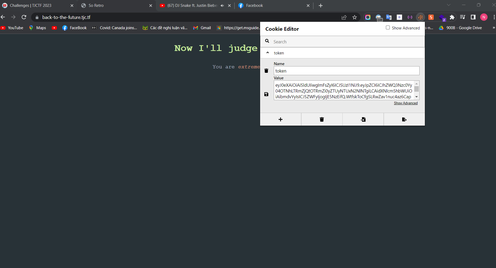
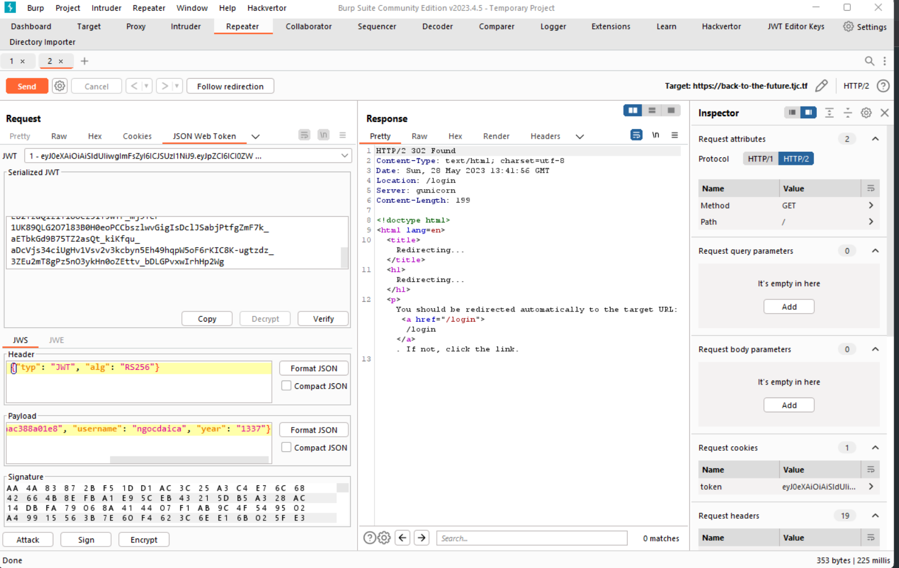
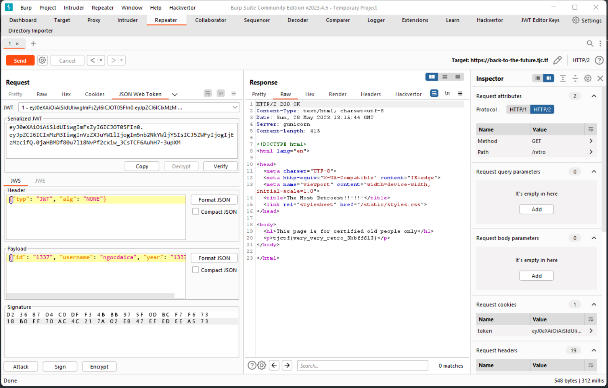

Challenge tiếp theo là back to the past, ồ quay về quá khứ



Trang web cũng cung cấp cho chúng ta một form đăng nhập 




Thử đăng kí với người dùng thử xem sao




Và có vẻ họ set cho chúng ta một JWT tokens, thử xem source code nào

```from flask import Flask, request, render_template, redirect, make_response
import uuid
import random
import jwt
import secrets
from functools import wraps

u2id = {}
u2year = {}

app = Flask(__name__)

app.static_folder = "static"

flag = open("flag.txt", "r").read()


def login_required():
    def _login_required(f):
        @wraps(f)
        def __login_required(*args, **kwargs):
            token = request.cookies.get("token")

            if not token:
                return redirect("/login")

            user = verify_token(token)

            if user is None:
                return redirect("/login")

            return f(*args, **kwargs, user=user)

        return __login_required

    return _login_required


private_key = open("private.key", "rb").read()
public_key = open("static/public_key.pem", "rb").read()


def generate_token(id, username, year):
    return jwt.encode(
        {"id": id, "username": username, "year": year}, private_key, algorithm="RS256"
    )


def verify_token(token):
    try:
        return jwt.decode(token.encode(), public_key, algorithms=["HS256", "RS256"])
    except:
        return None


@app.route("/static/<path:path>")
def static_file(filename):
    return app.send_static_file(filename)


@app.route("/")
@login_required()
def index(user):
    return render_template("index.html", year=int(user["year"]))


@app.route("/retro")
@login_required()
def retro(user):
    if int(user["year"]) > 1970:
        return render_template("retro.html", flag="you aren't *retro* enough")
    else:
        return render_template("retro.html", flag=flag)


@app.route("/login", methods=["GET"])
def get_login():
    return render_template("login.html")


@app.route("/login", methods=["POST"])
def post_login():
    username = request.form["username"]
    if not username:
        return redirect("/login?msg=No+username+provided")
    if username in u2id:
        resp = make_response(redirect("/"))
        resp.set_cookie(
            "token", generate_token(u2id[username], username, u2year[username])
        )
        return resp
    else:
        return redirect("/login?msg=Username+not+found")


@app.route("/register", methods=["GET"])
def get_register():
    return render_template("register.html")


@app.route("/register", methods=["POST"])
def post_register():
    username = request.form["username"]
    year = request.form["year"]

    if username in u2id:
        return redirect("/register?msg=So+unoriginal")
    if not username:
        return redirect("/register?msg=No+username+provided")
    if not year.isnumeric() or not 1970 < int(year) < 2024:
        return redirect("/register?msg=Invalid+year")

    id = str(uuid.uuid4())
    u2id[username] = id
    u2year[username] = year
    res = make_response(redirect("/"))
    res.set_cookie("token", generate_token(id, username, year))

    return res


if __name__ == "__main__":
    app.run(debug=True)
```


Yeah có vẻ như chúng ta phải đăng nhập với số năm nhỏ hơn 1970 để lấy được flag, nhưng có vẻ JWT token được mã hóa với hai alg là HS256, RS256 ý tưởng ở đây là ta có thể chuyển RS256 sang HS256 sau đó tìm secret key bằng cách brute force với jwt_tool, nhưng cách đó khá tốn thời gian và tất nhiên là mình lựa chọn cách đỡ tốn time là set alg là none bởi vì có vẻ khi set alg là none là có bypass qua bước verify sau đó set lại year thấp hơn 1970 là có thể lấy được flag




Và boom we get the flag


