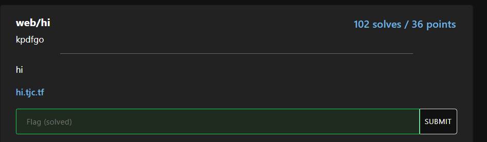
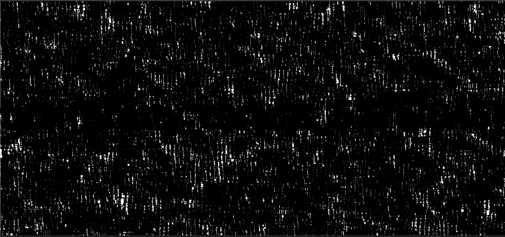
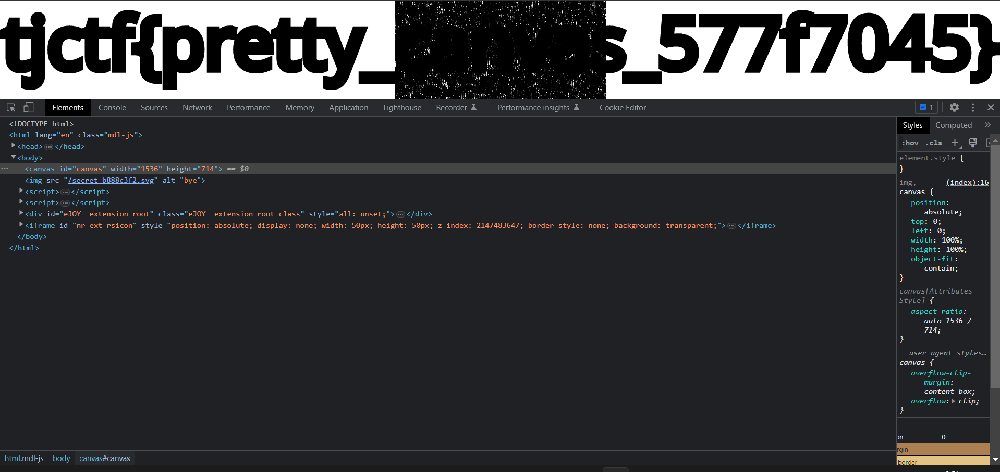
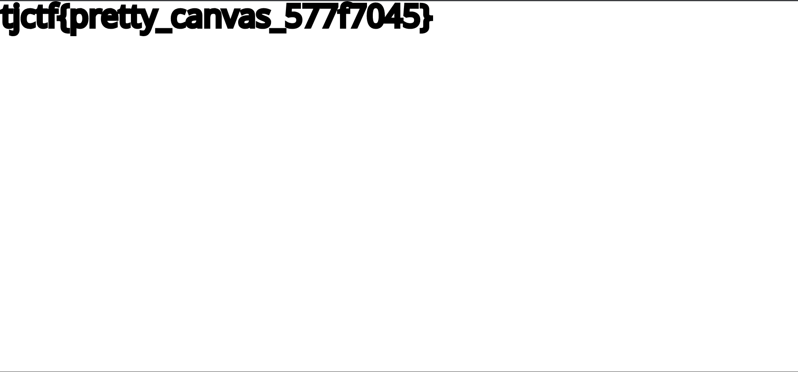

Challenge đầu tiên là hi, challenge này có vẻ chỉ để warm up thì phải 

Ok vào link tác giả cung cấp thôi, có vẻ chỉ là một bức ảnh được làm mờ 

Vậy khả năng flag được giấu sau bức ảnh 

Yeah có vẻ đúng rồi, ta click vào link file .svg là có được flag 

