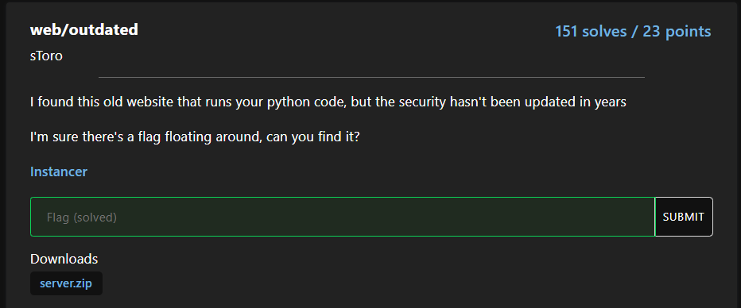
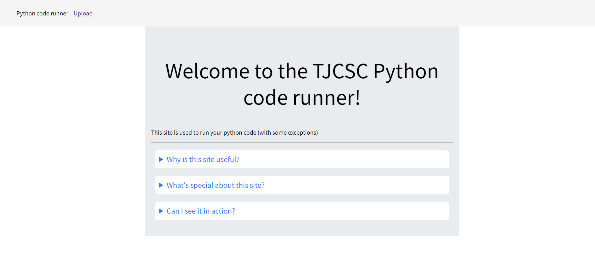
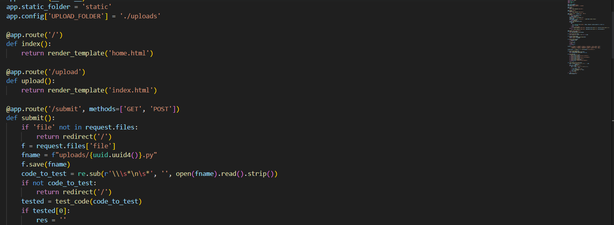
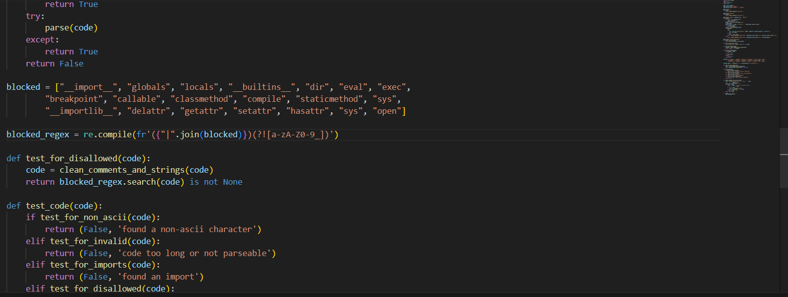
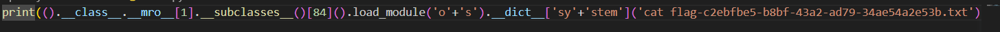
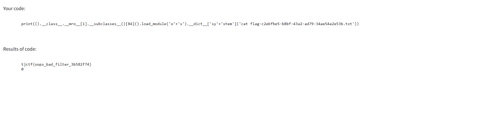

Challenge tiếp theo là outdated

Yeah có vẻ là một trình biên dịch python thì phải :>, có vẻ ta sẽ thực thi RCE với trang web này, nhưng điều đó có vẻ không dễ dàng

Dường như có vẻ tác giả đã tạo ra một blacklist như trên nhằm tránh chúng ta thực thi RCE, có vẻ khá khó vì mình không có chơi pyjail nhiều cho lắm, nhưng mất gần nửa ngày thử các payload thì mình đã thành công 

Mình cũng chả nhớ tìm được nguồn nào nữa, chỉ biết là nó worked và yeah, bạn có thể search, tay to search thì nhanh thôi mình tay bé :<

Vậy là ta đã có được flag rồi, lấy flag thôi :>

