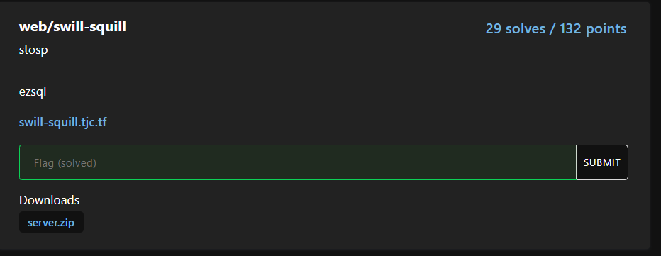
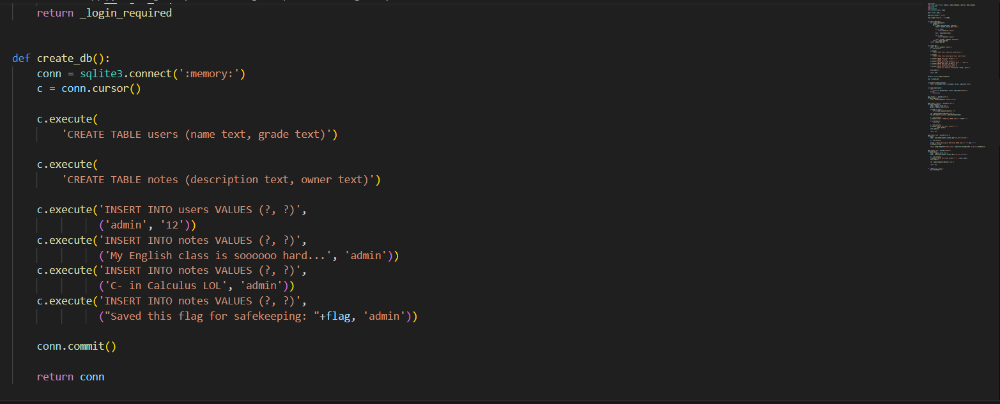
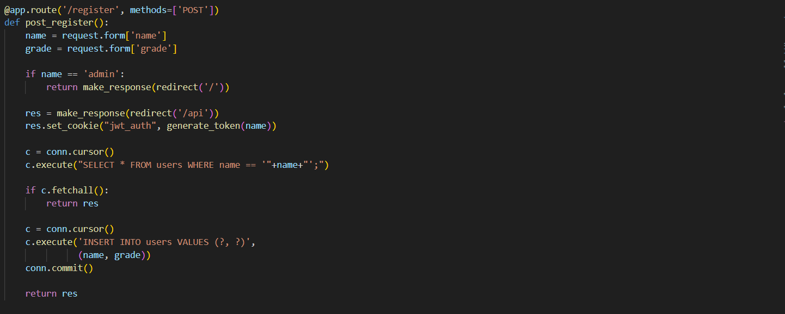
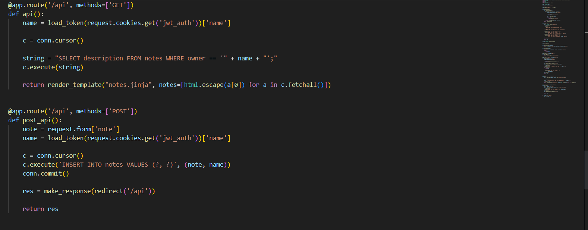
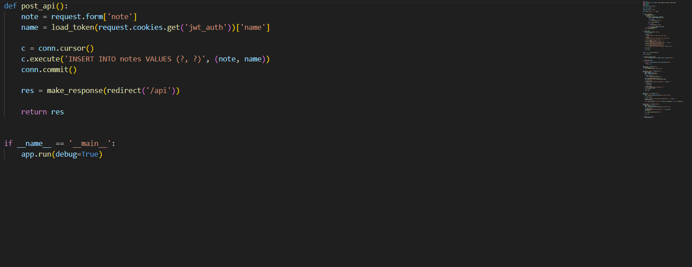
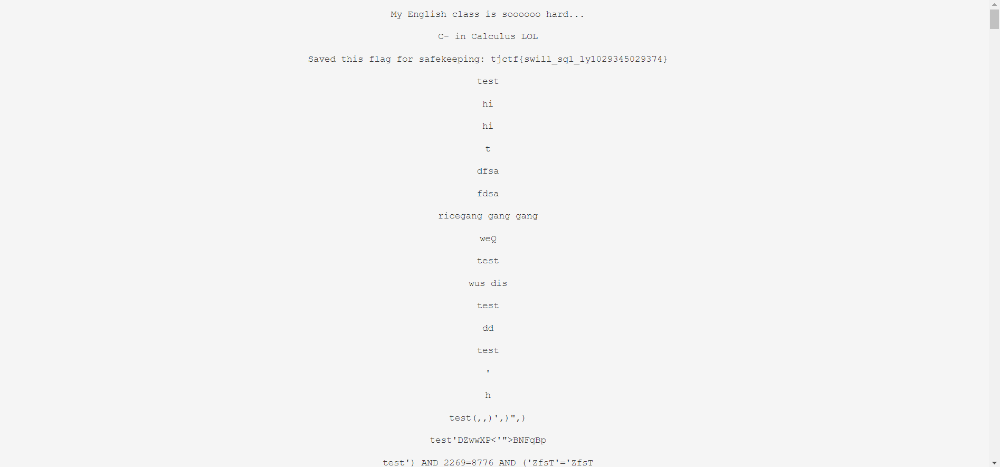

Challenge tiếp theo nào :>

Vào trang web tác giả cung cấp thôi 

Nó cho ta hai trường là name và grade mình nghĩ liệu có phải là SQLi không nhỉ, để xem ý tưởng đó có đúng không thì chúng ta vào source code tác giả cung cấp xem

Yeah có vẻ khi ta nhập vào hai trường name và grade server sẽ tạo ra cho chúng ta một đối tượng chứa name và grade tương ứng và khi ta nhập note vào nó sẽ chèn nội dung ta vừa nhập vào bảng notes sau đó in ra những gì chúng ta vừa nhập, và nếu chúng ta nhập vào trường name admin nó sẽ chuyển chúng ta về trang ban đầu. Để lấy được flag thì rõ ràng chúng ta phải đăng nhập với tư cách admin, tuy nhiên như tôi đã nói ở trên nó sẽ chặn chúng ta nhập admin vào vậy đơn giản là dùng SQLi thôi yeah khá là basic thôi

Và boom ta đã có được flag :>

